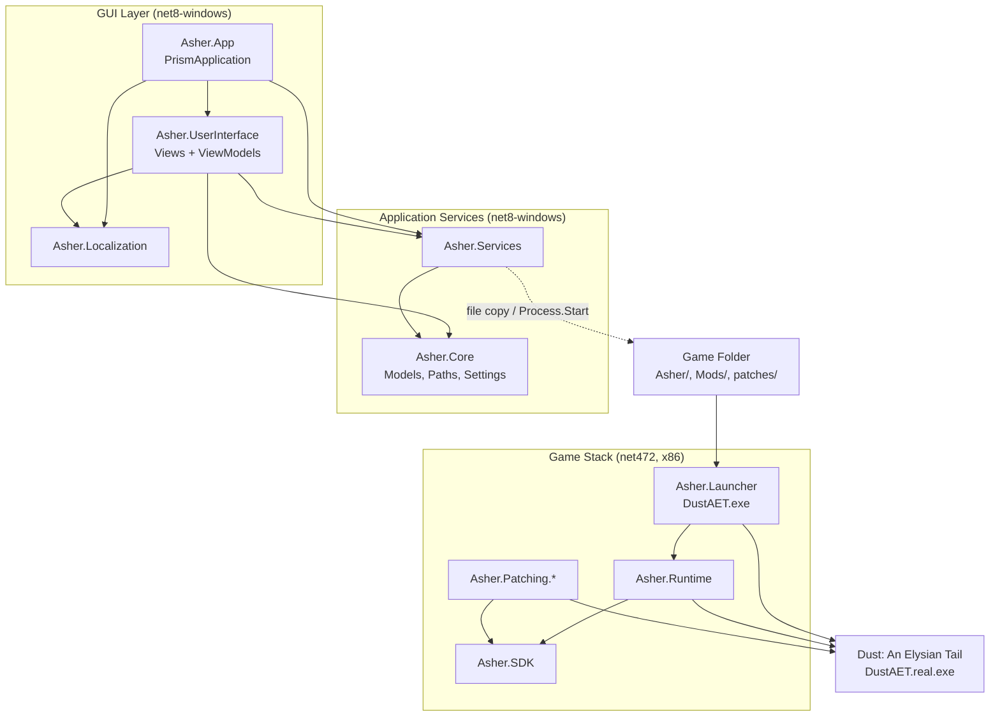
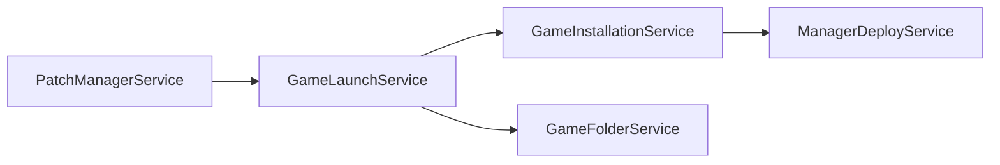
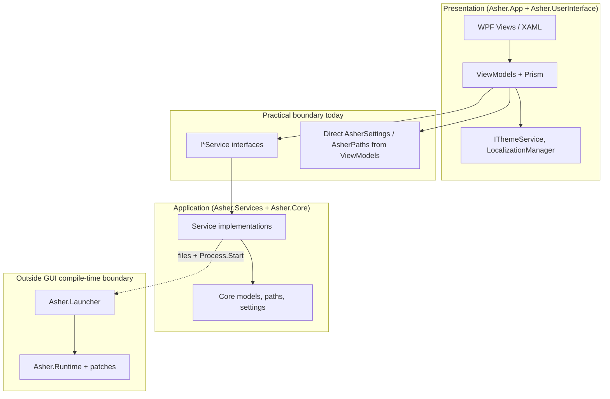

# Asher GUI Architecture Investigation Report

> **Historical reference:** This document describes the **retired WPF** UI (`Asher.App` + `Asher.UserInterface`). The shipping manager is now **Electron + `Asher.Host`**.

Investigation of the current graphical interface architecture of the Asher project, with focus on UI structure, backend communication, and component interaction during the application lifecycle.

**Status:** Investigation-only baseline (no implementation changes).  
**Date:** August 28, 2026

---

## Table of Contents

1. [Current GUI Architecture](#1-current-gui-architecture)
2. [Application Startup Flow](#2-application-startup-flow)
3. [GUI ↔ Backend Interaction](#3-gui--backend-interaction)
4. [Project and Layer Boundaries](#4-project-and-layer-boundaries)
5. [Representative End-to-End Flows](#5-representative-end-to-end-flows)
6. [State, Events, and Lifecycle](#6-state-events-and-lifecycle)
7. [Platform-Specific Dependencies](#7-platform-specific-dependencies)
8. [Architecture Map](#8-architecture-map)
9. [Findings Summary](#9-findings-summary)
10. [Core and Services Boundary Investigation](#10-core-and-services-boundary-investigation)
11. [Strategic Preparation for Alternative Frontend](#11-strategic-preparation-for-alternative-frontend)
12. [Future Frontend/Application Boundary](#12-future-frontendapplication-boundary)

---

## 1. Current GUI Architecture

### GUI-Providing Projects

| Project | Role | Framework |
|---------|------|-----------|
| **`Asher.App`** | WPF host / composition root | .NET 8 (`net8.0-windows`, `UseWPF`) |
| **`Asher.UserInterface`** | Views, ViewModels, UI services, Prism module | .NET 8 WPF + WinForms (`UseWindowsForms`) |

`Asher.Launcher` has a WinForms `MessageBox` for fatal errors only; it is **not** the mod manager GUI.

### UI Stack

- **WPF** — primary UI framework
- **Prism 9** (`Prism.Unity`, `Prism.Core`) — MVVM, regions, navigation, `IEventAggregator`, `DelegateCommand`
- **Material Design In XAML** (`MaterialDesignThemes` 5.3) — theming and controls
- **Unity** (via `Prism.Unity`) — DI container

### Entry Point

`Asher.App` is the GUI entry point. `App` inherits `PrismApplication`:

```csharp
// Asher.App/App.xaml.cs
public partial class App : PrismApplication
{
    protected override void OnStartup(StartupEventArgs e)
    {
        var settings = AsherSettings.Load();
        LocalizationManager.Initialize(settings.Language);
        new ThemeService().Apply(
            string.IsNullOrWhiteSpace(settings.Theme) ? "Light" : settings.Theme);

        base.OnStartup(e);
    }

    protected override Window CreateShell() => Container.Resolve<MainWindow>();
    // RegisterTypes, ConfigureModuleCatalog → ViewsModule
}
```

There is no explicit `Main()` in `Asher.App`; WPF/Prism bootstrap handles process startup.

### Main Window / Application Shell

- **View:** `Asher.UserInterface/Views/MainWindow.xaml`
- **ViewModel:** `MainWindowViewModel` (auto-wired via `prism:ViewModelLocator.AutoWireViewModel="True"`)
- **Layout:** animated sidebar + `ContentControl` bound to Prism region `MainRegion`

`MainWindow.xaml.cs` triggers startup navigation after load:

```csharp
// Asher.UserInterface/Views/MainWindow.xaml.cs
private void OnLoaded(object sender, RoutedEventArgs e)
{
    Loaded -= OnLoaded;

    if (DataContext is ViewModels.MainWindowViewModel viewModel)
        viewModel.PerformStartupNavigation();
}
```

### View Organization

```
Asher.UserInterface/
├── Views/           # XAML UserControls + MainWindow
├── ViewModels/      # One ViewModel per major view
├── Converters/      # WPF value converters
├── Behaviors/       # Attached behaviors (sidebar animation)
├── Services/        # IThemeService / ThemeService
├── Events/          # UninstallCompleteEvent
└── ViewsModule.cs   # Prism navigation registration
```

**Normal-mode views** (post-install): `HomeView`, `ContentPatcherView`, `PatchManagerView`, `SettingsView`, `UninstallProgressView`

**Installation-mode views:** `WelcomeView`, `GameDetectionView`, `InstallationProgressView`, `InstallationResultView`

Registered in `ViewsModule.RegisterTypes`.

### Navigation System

Prism region-based navigation:

- Region name: `RegionNames.Main` (`"MainRegion"`) — see `Asher.UserInterface/NavigationNames.cs`
- Navigation keys in `NavigationNames` and `InstallationNavigationNames`
- `MainWindowViewModel.NavigateCommand` → `_regionManager.RequestNavigate(RegionNames.Main, item.NavigationPath)`
- Two sidebar item collections: `NavigationItems` (normal) vs `InstallationNavigationItems` (wizard)
- Mode switch driven by install detection and pub/sub events (`InstallationCompleteEvent`, `UninstallCompleteEvent`)

`INavigationItemsManager` / `NavigationItemsManager` builds `NavigationItem` instances for the sidebar.

### Presentation Pattern

**Prism MVVM** throughout:

- Views bind to ViewModels via `ViewModelLocator.AutoWireViewModel`
- ViewModels inherit `BaseViewModel` → `BindableBase` + `INavigationAware`
- Commands via `DelegateCommand` / `DelegateCommand<T>`
- Cross-ViewModel communication via `IEventAggregator` pub/sub

`BaseViewModel` defines `InitAsync()` on all ViewModels, but **nothing in the codebase calls `InitAsync()`** — it is currently unused scaffolding.

### Dependency Injection

Configured only in `Asher.App/App.xaml.cs`:

| Registration | Lifetime |
|--------------|----------|
| `MainWindow` | transient |
| `IGameFolderService` → `GameFolderService` | singleton |
| `IPatchManagerService` → `PatchManagerService` | singleton |
| `IGameInstallationService` → `GameInstallationService` | singleton |
| `IInstallationStateService` → `InstallationStateService` | singleton |
| `INavigationItemsManager` → `NavigationItemsManager` | singleton |
| `IGameLaunchService` → `GameLaunchService` | singleton |
| `IShortcutService` → `ShortcutService` | singleton |
| `IManagerLaunchService` → `ManagerLaunchService` | singleton |
| `IManagerDeployService` → `ManagerDeployService` | singleton |
| `IThemeService` → `ThemeService` | singleton |

Views/ViewModels are registered for navigation in `ViewsModule`; Prism resolves their constructor dependencies automatically.

### Application-Level State

State is **distributed**, not centralized:

| State | Location | Mechanism |
|-------|----------|-----------|
| Persistent settings | `AsherSettings` (JSON) | `%AppData%\Asher\settings.json`, local `settings.json`, game `Asher/Asher.App/settings.json` |
| Install wizard transient state | `InstallationStateService` | In-memory `GameFolderInfo`, `InstallationResult` |
| Shell navigation/mode | `MainWindowViewModel` | `IsInstallationMode`, nav collections, `_currentNavigationPath` |
| Per-view state | Individual ViewModels | Bindable properties |
| Mod list | `PatchManagerViewModel.AvailablePatches` | Loaded from filesystem via service |
| Language/theme | `LocalizationManager` singleton + `IThemeService` | Events + MaterialDesign palette |

---

## 2. Application Startup Flow

```text
Process start (Asher.App.exe)
    ↓
App.OnStartup
    ├─ AsherSettings.Load()          (multi-path JSON lookup)
    ├─ LocalizationManager.Initialize(language)
    ├─ ThemeService.Apply(theme)     (pre-Prism instance)
    └─ base.OnStartup(e)             (Prism bootstrap)
         ├─ RegisterTypes (App)        (9 singleton services)
         ├─ ConfigureModuleCatalog    (ViewsModule)
         ├─ ViewsModule.RegisterTypes (navigation views)
         ├─ CreateShell → MainWindow
         └─ OnInitialized
              └─ IThemeService.Apply again
    ↓
MainWindow.Loaded
    └─ MainWindowViewModel.PerformStartupNavigation()
         ├─ ResolveInstalledGamePath()
         │    ├─ AsherPaths.TryGetGameFolderFromManagerLocation()
         │    └─ settings.GameFolderPath + IGameInstallationService.IsInstalled()
         ├─ If not installed → IsInstallationMode=true → navigate WelcomeView
         └─ If installed → migrate layout → IsInstallationMode=false → navigate HomeView
    ↓
User can interact
```

**Before interaction:** settings load, localization, theme, DI container build, module init, shell creation, install-state detection, initial region navigation.

**Notable:** `ManagerDeployService.ApplyPendingPayload()` exists but is **never called at startup**; pending manager updates are handled via `TryFinishInstallWithPendingPayload` (batch script) at end of install flow only.

---

## 3. GUI ↔ Backend Interaction

The GUI **does not reference** `Asher.Runtime` or `Asher.Launcher` at compile time. Interaction with game/runtime logic is **filesystem + process launch**.

### Communication Mechanisms

| Mechanism | Usage |
|-----------|-------|
| **Constructor DI** | ViewModels → `Asher.Services.Interfaces` |
| **Direct service calls** | Commands and `OnNavigatedTo` handlers |
| **Prism pub/sub** | `InstallationCompleteEvent`, `UninstallCompleteEvent` |
| **Prism region navigation** | Wizard and main navigation |
| **`IProgress<T>`** | Install/uninstall progress reporting |
| **`Dispatcher.Invoke`** | Game detection background → UI thread |
| **MessageBox / FolderBrowserDialog** | Errors, confirmations, folder pickers |
| **File/process operations** | Services copy DLLs, rename exe, `Process.Start` game |

### Services Used by UI

| ViewModel | Services |
|-----------|----------|
| `MainWindowViewModel` | `IRegionManager`, `IEventAggregator`, `INavigationItemsManager`, `IGameInstallationService` |
| `GameDetectionViewModel` | `IGameFolderService`, `IInstallationStateService`, `IRegionManager`, `IEventAggregator` |
| `InstallationProgressViewModel` | `IGameInstallationService`, `IInstallationStateService`, `IRegionManager` |
| `InstallationResultViewModel` | `IInstallationStateService`, `IShortcutService`, `IManagerLaunchService`, `IManagerDeployService`, `IEventAggregator` |
| `HomeViewModel` | `IGameLaunchService`, `IRegionManager` |
| `PatchManagerViewModel` | `IPatchManagerService` |
| `SettingsViewModel` | `IGameFolderService`, `IGameLaunchService`, `IGameInstallationService`, `IThemeService`, `IRegionManager` |
| `UninstallProgressViewModel` | `IGameInstallationService`, `IGameLaunchService`, `IEventAggregator`, `IRegionManager` |
| `ContentPatcherViewModel` | **none** (stub) |

### Async Patterns

- `GameInstallationService.InstallAsync` / `UninstallAsync` — `Task.Run` for file IO, reports via `IProgress<InstallationProgress>`
- `InstallationProgressViewModel.OnNavigatedTo` — `async` calls `InstallAsync`, navigates on completion
- `GameDetectionViewModel` — `Task.Run` + `Dispatcher.Invoke` for detection
- `PatchManagerService.GetModsAsync` — returns completed `Task` (sync filesystem scan)

### Progress Representation

`InstallationProgress` model with `Percentage`, `Message`, `Details` → bound to progress bars in `InstallationProgressView` / `UninstallProgressView`.

### Error Propagation

- Services return `InstallationResult { Success, Message, Error }`
- ViewModels navigate to result view or show `MessageBox`
- No global exception handler or centralized error service in the GUI
- Runtime/launcher errors go to log files (`AsherLogs/`) and WinForms `MessageBox` in launcher — **not surfaced in the WPF app**

### Logging to UI

**No log streaming to the GUI.** Runtime uses `RuntimeLogger` → files under `Asher/AsherLogs/`.

---

## 4. Project and Layer Boundaries

### Solution Projects

```text
Asher.App              → GUI host (net8-windows)
Asher.UserInterface    → WPF views/VMs (net8-windows)
Asher.Services         → Application services (net8-windows)
Asher.Core             → Models, paths, settings (net8-windows)
Asher.Localization     → RESX strings (net8-windows)
Asher.Launcher         → Game entry shim (net472, x86)
Asher.Runtime          → In-game mod runtime (net472, x86)
Asher.SDK              → Mod/patch contracts (net472)
Asher.Patching.*       → Harmony patch modules (net472)
```

### Dependency Graph (Compile-Time)

```text
Asher.App
  → Asher.UserInterface, Asher.Services, Asher.Localization

Asher.UserInterface
  → Asher.Services, Asher.Core, Asher.Localization

Asher.Services
  → Asher.Core

Asher.Launcher
  → Asher.Runtime → Asher.SDK

Asher.Patching.*
  → Asher.SDK
```

**GUI-independent layers:** `Asher.Runtime`, `Asher.SDK`, `Asher.Launcher`, all patch projects.

**GUI stack:** `Asher.App` + `Asher.UserInterface` + `Asher.Services` + `Asher.Core` + `Asher.Localization`.

### Boundary Leaks (Documented — Not Recommendations)

1. **`Asher.Core` has WPF/UI dependencies:** `UseWPF`, `MaterialDesignThemes`, `Prism.Core`; `NavigationItem` uses `PackIconKind`; models use `BindableBase`.
2. **`Asher.Services` uses `MaterialDesignThemes.Wpf.PackIconKind`** in `NavigationItemsManager`.
3. **`InstallationCompleteEvent`** lives in `Asher.Core/Events/InstallationCompleteEvent.cs` but namespace is `Asher.UserInterface.Events` (UI namespace in Core assembly).
4. **ViewModels call WPF/WinForms directly:** `MessageBox`, `FolderBrowserDialog`, `Application.Current.Shutdown()`, `Dispatcher.Invoke`.
5. **`MainWindowViewModel` loads `AsherSettings` directly** rather than through a settings service.
6. **Settings flags** (`AutoLaunchEnabled`, `BackupEnabled`, `CheckForUpdatesEnabled`) are persisted in UI but **not read** by launch/install services.

---

## 5. Representative End-to-End Flows

### Flow A: Game Detection and Installation

```text
User clicks "Begin Installation" (WelcomeView)
    ↓
WelcomeViewModel.BeginInstallationCommand
    ↓
IRegionManager → GameDetectionView
    ↓
GameDetectionViewModel.OnNavigatedTo → DetectGameFolderCommand (auto)
    ↓
Task.Run → IGameFolderService.DetectGameFolder()
    │         (Steam/GOG/Humble paths, settings, manager location)
    ↓
Dispatcher.Invoke → UpdateGameInfo()
    ↓
IInstallationStateService.SetGameFolder(gameInfo)
    ↓
User clicks Continue
    ↓
IGameFolderService.CreatePatchesFolder()
    ↓
IRegionManager → InstallationProgressView
    ↓
InstallationProgressViewModel.OnNavigatedTo
    ↓
IGameInstallationService.InstallAsync(gameInfo, IProgress<...>)
    │   ├─ backup DustAET.exe
    │   ├─ create Asher/, Mods/, AsherLogs/, patches/, etc.
    │   ├─ copy Asher.Runtime.dll, Asher.SDK.dll, 0Harmony.dll
    │   ├─ copy default patch DLLs
    │   ├─ rename DustAET.exe → DustAET.real.exe
    │   ├─ copy Asher.Launcher.exe → DustAET.exe
    │   └─ IManagerDeployService deploy/stage manager to Asher/Asher.App/
    ↓
IProgress callbacks → UI progress properties
    ↓
IInstallationStateService.SetInstallationResult(result)
    ↓
IRegionManager → InstallationResultView
    ↓
User clicks Finish
    ↓
AsherSettings.MarkAsInstalled(), optional desktop shortcut
    ↓
If pending payload / relaunch needed → Shutdown + script or relaunch
    Else → IEventAggregator.Publish(InstallationCompleteEvent)
    ↓
MainWindowViewModel.OnInstallationComplete
    → IsInstallationMode=false, normal nav, navigate HomeView
```

### Flow B: Launch Game

```text
User clicks Launch Game (HomeView)
    ↓
HomeViewModel.LaunchGameCommand
    ↓
IGameLaunchService.TryLaunchGame()
    ├─ ResolveGameFolderPath() (manager location, settings, detection)
    └─ Process.Start(DustAET.exe) with WorkingDirectory = game folder
    ↓
[DustAET.exe is Asher.Launcher renamed]
    ↓
Asher.Launcher.Program.Main
    ├─ RuntimeEntry.Init(context)
    ├─ Assembly.LoadFrom(DustAET.real.exe)
    ├─ AssemblyLoader.LoadAssembliesFrom(Mods/)
    ├─ PreInitBootstrap, PatchModuleLoader (Harmony)
    └─ Dust.Program.Main(args)  → game runs
    ↓
On failure in GUI: MessageBox with error string
```

### Flow C: Toggle Mod Enabled State

```text
User toggles mod switch (PatchManagerView)
    ↓
ManagedModInfo.IsEnabled property change
    ↓
PatchManagerViewModel.OnPatchPropertyChanged
    ↓
IPatchManagerService.SetModEnabledAsync(fileName, enabled)
    │   moves DLL between Mods/ and Mods/disabled/
    ↓
UpdatePatchCounts() → UI counters refresh
```

Effect applies on **next game launch**, not live.

### Flow D: Change Settings

```text
User changes language/theme (SettingsView)
    ↓
SettingsViewModel property setter
    ├─ LocalizationManager.ApplyCulture() or IThemeService.Apply()
    └─ ExecuteSaveSettingsCommand()
    ↓
AsherSettings.Load() → mutate → Save() (AppData + local + game manager path)
    ↓
LocalizationManager.LanguageChanged → BaseViewModel / MainWindowViewModel refresh labels
```

---

## 6. State, Events, and Lifecycle

### Application Startup / Shutdown

- **Startup:** described in §2
- **Shutdown:** only explicit calls in `InstallationResultViewModel` after relaunch/payload apply; no `App.OnExit` handler

### Game Process State

- **Not tracked in GUI** — `Process.Start` is fire-and-forget
- No monitoring of game running/exited in ViewModels or services

### Mod State

- Filesystem-based: `Mods/*.dll` vs `Mods/disabled/*.dll`
- `PatchManagerViewModel` reloads on navigation/refresh
- Runtime loads mods at game startup only

### Loading States

- `IsDetecting` (game detection)
- `IsIndeterminate` + `ProgressPercentage` (install/uninstall)
- No global loading overlay

### Errors

- Per-flow `MessageBox` or result views
- `InstallationResultViewModel` shows `ErrorDetails` from exception

### Configuration Changes

- Immediate theme/language apply + JSON persist
- Game path change in settings saves to JSON but does not re-validate install inline beyond browse dialog

### UI Refreshes

- `INotifyPropertyChanged` / Prism `BindableBase`
- `LocalizationManager.LanguageChanged` propagates to ViewModels
- Region navigation triggers `OnNavigatedTo` reloads (patches, settings, uninstall)

### Notifications

- No toast/notification system
- `MessageBox` only

### Cross-Component Events

| Event | Publisher | Subscriber |
|-------|-----------|------------|
| `InstallationCompleteEvent` | `InstallationResultViewModel` | `MainWindowViewModel` |
| `UninstallCompleteEvent` | `UninstallProgressViewModel` | `MainWindowViewModel` |
| `LocalizationManager.LanguageChanged` | `LocalizationManager` | `BaseViewModel`, `MainWindowViewModel` |

`INavigationItemsManager.ActivateStep` exists for wizard step enabling but is **never called**.

---

## 7. Platform-Specific Dependencies

### GUI-Specific

| Dependency | Where |
|------------|-------|
| WPF (`UseWPF`) | `Asher.App`, `Asher.UserInterface`, `Asher.Core` |
| WinForms `FolderBrowserDialog` | `GameDetectionViewModel`, `SettingsViewModel` |
| WinForms in launcher errors | `Asher.Launcher/Program.cs` |
| Material Design WPF | `Asher.App`, `Asher.UserInterface`, `Asher.Core` |
| `WScript.Shell` COM (shortcuts) | `ShortcutService` |
| `Environment.SpecialFolder` paths | settings, desktop shortcut |
| `Process.Start` / `UseShellExecute` | game launch, manager relaunch |
| Windows batch script (`tasklist`, `robocopy`) | `ManagerLaunchService.TryFinishInstallWithPendingPayload` |
| Hardcoded drive paths (`C:\Steam`, `D:\Games`, etc.) | `GameFolderService` |
| Steam `libraryfolders.vdf` parsing | `GameFolderService` |
| x86 platform target | solution builds `x86` only |

### Backend / Application (Non-GUI but Windows-Oriented)

| Dependency | Where |
|------------|-------|
| `net8.0-windows` TFM | App, UI, Services, Core, Localization |
| File layout assumptions (`DustAET.exe`, `Asher/`, etc.) | `AsherPaths`, `GameInstallationService` |
| `FileVersionInfo` | game version detection |
| Process enumeration by exe path | `ManagerDeployService.IsManagerRunningAt` |

### Runtime / Game-Specific

| Dependency | Where |
|------------|-------|
| .NET Framework 4.7.2, x86 | Runtime, Launcher, SDK, Patches |
| Harmony 2.4.2 (net472) | Runtime, SDK, patches |
| `Microsoft.Xna.Framework.Game` | Runtime, patch projects (game type reflection) |
| `Dust.Program.Main` invocation | `Asher.Launcher` |
| `Assembly.LoadFrom` / custom `AssemblyResolve` | Launcher |
| Game-specific Harmony patches | `Asher.Patching.*` (e.g. `Game1.DrawStartup`) |

**No Windows Registry usage** was found in the codebase.

---

## 8. Architecture Map

### Mermaid Diagram



### Simplified Textual Map

```text
Asher.App (Prism host)
 ↓
Asher.UserInterface (Views / ViewModels / Prism module)
 ↓
Asher.Services (install, launch, mods, deploy, shortcuts)
 ↓
Asher.Core (settings, paths, models)
 ↓
Filesystem in game directory (Asher/, Mods/, Asher.App/)
 ↓
Asher.Launcher (replaces DustAET.exe)
 ↓
Asher.Runtime + Asher.SDK + patch DLLs
 ↓
Dust: An Elysian Tail (XNA game)
```

---

## 9. Findings Summary

### Confirmed

1. GUI is **WPF + Prism MVVM** split across `Asher.App` (composition root) and `Asher.UserInterface` (presentation).
2. **Prism regions** provide all in-app navigation; install wizard and normal mode share one content region.
3. UI talks to backend exclusively through **`Asher.Services`** interfaces registered in `App.RegisterTypes`.
4. **No compile-time link** between GUI and `Asher.Runtime` / `Asher.Launcher`; integration is via deployed files and `Process.Start`.
5. Install flow physically patches the game directory (backup exe, deploy runtime DLLs, replace launcher).
6. Mod management in GUI is **filesystem enable/disable** (`Mods/` ↔ `Mods/disabled/`), not runtime API calls.
7. Settings persist as **JSON** in up to three locations via `AsherSettings`.
8. Dual-target architecture: **net8-windows** for manager, **net472 x86** for game injection (documented in `Asher.App.csproj` comment).
9. `ContentPatcherView` / `ContentPatcherViewModel` are **stubs** (TODO, no service).
10. `IPatchManagerService` Harmony patch methods (`GetAvailablePatchesAsync`, etc.) return **empty/false stubs**.

### Unclear

1. Whether `InstallationCompleteEvent` in `Asher.Core` assembly with `Asher.UserInterface.Events` namespace is intentional or an organizational mistake.
2. Intended use of `INavigationItemsManager.ActivateStep` — implemented but unused; wizard sidebar enablement may not match current step.
3. Whether `ManagerDeployService.ApplyPendingPayload` is dead code or reserved for a future startup path.
4. Intended behavior of `AutoLaunchEnabled`, `BackupEnabled`, `CheckForUpdatesEnabled` — stored but not consumed outside settings UI.
5. Distribution layout after `PrepareDistribution.ps1` — script exists but full deploy topology was not traced in this investigation.

### Important Constraints

1. **Two runtimes:** GUI cannot directly load or call Runtime/Launcher APIs; any future UI features for in-game state require a new bridge (files, IPC, etc.) — not present today.
2. **x86-only game stack** with .NET Framework 4.7.2 and net472 Harmony — constrains mod/runtime dependencies.
3. **Windows desktop assumptions** are embedded in detection, shortcuts, batch deploy, and folder dialogs.
4. **`Asher.Core` is not UI-agnostic** — WPF/MaterialDesign/Prism types in models and events blur layer boundaries.
5. **Game must be launched via patched `DustAET.exe`** for mods/runtime to load; launching `DustAET.real.exe` bypasses Asher.
6. **Manager self-deployment** — after install, app may shut down and relaunch from `GameFolder/Asher/Asher.App/Asher.App.exe` via script.
7. **Mod/patch changes take effect on next game start**, not while game is running.
8. **No centralized error/logging UI** — operational diagnostics live in `Asher/AsherLogs/` on disk.
9. **Content patcher and advanced Harmony patch management are not implemented** in the current service layer despite UI placeholders.

---

# Asher GUI Architecture Investigation Report

**Status:** Investigation-only baseline (no implementation changes).

## Table of Contents

- [10. Core and Services Boundary Investigation](#10-core-and-services-boundary-investigation)
- [11. Strategic Preparation for Alternative Frontend](#11-strategic-preparation-for-alternative-frontend)
- [12. Future Frontend/Application Boundary](#12-future-frontendapplication-boundary)
- [Key Source Files Reference](#key-source-files-reference)

*Sections 1–9 (GUI architecture, startup, flows, platform dependencies, initial findings) were documented in the initial investigation revision and are referenced by §10.*

---

Extended investigation of `Asher.Core` and `Asher.Services`, focused on UI coupling, platform coupling, game coupling, and portability. Builds on sections 1–9; prior findings were re-verified against current source.

**Correction from §9:** `ActivateNavigationOptionEvent` (`Asher.Core/Events/ActivateNavigationOptionEvent.cs`) is defined but **never published or subscribed** anywhere in the solution — dead code, not merely unused `ActivateStep`.

### 10.1 Asher.Core Analysis

**Project metadata:** `net8.0-windows`, `UseWPF=true`, packages: `Prism.Core`, `MaterialDesignThemes`, `Newtonsoft.Json`. No project references.

**Consumers:** `Asher.Services`, `Asher.UserInterface`, `Asher.App` (settings only).

#### `AsherPaths` (`AsherPaths.cs`)

| Aspect | Detail |
|--------|--------|
| **Responsibility** | Canonical folder/file names and path composition for game install layout, manager location inference, legacy layout migration |
| **Dependencies** | `System.IO` only (direct); constants reference `DustAET.exe`, `DustAET.real.exe`, `Asher.Launcher.exe` |
| **Consumers** | All `Asher.Services` implementations; `MainWindowViewModel`, `InstallationProgressViewModel`, `SettingsViewModel`, `InstallationResultViewModel` |
| **Classification** | Game-dependent, Windows/platform-dependent (`.exe` names, `AppDomain.CurrentDomain.BaseDirectory`, Windows path conventions). Path *logic* is conceptually portable; constants are not |

Key behaviors: `TryGetGameFolderFromManagerLocation()` infers game root from `…/Asher/Asher.App/` install layout. `IsValidGameFolder` / `IsAsherInstalledIn` encode Dust-specific executable checks. `MigrateLegacyLayout` moves directories on disk.

#### `AsherSettings` (`AsherSettings.cs`)

| Aspect | Detail |
|--------|--------|
| **Responsibility** | Load/save user settings as JSON; multi-location persistence; install state markers |
| **Dependencies** | `Newtonsoft.Json`, `System.IO`, `Environment.SpecialFolder.ApplicationData`, `AsherPaths` |
| **Consumers** | `Asher.App` (startup), all major ViewModels, `GameFolderService`, `GameLaunchService`, `GameInstallationService` (indirect via ViewModels) |
| **Classification** | Windows-dependent (`ApplicationData` path). Mixed domain: `GameFolderPath`/`GameVersion` are game-dependent; `Theme` is UI-dependent; `Language` is portable; `AutoLaunchEnabled`/`BackupEnabled`/`CheckForUpdatesEnabled` are persisted but unused by Services |

Load order: local `settings.json` → manager-folder settings → `%AppData%\Asher\settings.json`. Save writes to all applicable locations.

#### Models — Plain DTOs

| Component | Responsibility | Dependencies | Classification |
|-----------|----------------|--------------|----------------|
| `GameFolderInfo` | Detected game folder metadata (`Path`, `Version`, `IsValid`, `Source`, patches folder flags) | None | Game-dependent naming; structurally portable |
| `InstallationResult` | Install/uninstall outcome (`Success`, `Message`, `GameFolderPath`, `Error`) | `System` | Potentially platform-independent |
| `InstallationProgress` | Progress reporting DTO (`Percentage`, `Message`, `Details`) | None | Potentially platform-independent |
| `PatchProgress` | Patch operation progress DTO | None | Potentially platform-independent |
| `HarmonyValidationResult` | Patch validation result lists | None | Game/runtime-dependent (Harmony concept); structurally portable |

#### Models — Presentation-Coupled

| Component | Responsibility | UI Dependencies | Notes |
|-----------|----------------|-----------------|-------|
| `NavigationItem` | Sidebar navigation entry (label, path, selection, enabled state) | `BindableBase` (Prism), `PackIconKind` (MaterialDesign WPF) | Used by `MainWindowViewModel` and XAML `ItemsControl` bindings |
| `ManagedModInfo` | Mod list item for Patch Manager UI | `BindableBase` (Prism) | Two-way `IsEnabled` binding drives `PatchManagerViewModel` |
| `HarmonyPatchInfo` | Harmony patch descriptor (unused in live flows) | `BindableBase` (Prism) | `IPatchManagerService` Harmony methods are stubs |

#### Events (`Asher.Core/Events/`)

| Component | Namespace | Base Type | Used? | Classification |
|-----------|-----------|-----------|-------|----------------|
| `InstallationCompleteEvent` | `Asher.UserInterface.Events` | `PubSubEvent` (Prism) | Yes — `InstallationResultViewModel` publishes; `MainWindowViewModel` subscribes | UI-dependent; file lives in Core assembly with UI namespace |
| `ActivateNavigationOptionEvent` | `Asher.UserInterface.Events` | `PubSubEvent<string>` (Prism) | **No** — dead code | UI-dependent |

Both event classes compile into **`Asher.Core`** despite `Asher.UserInterface.Events` namespace — organizational anomaly confirmed.

### 10.2 Asher.Services Analysis

**Project metadata:** `net8.0-windows`, `PlatformTarget=x86`, single reference to `Asher.Core`. No explicit NuGet packages; inherits `MaterialDesignThemes` and `Prism` transitively via Core for `NavigationItemsManager`.

**Consumers:** `Asher.App` (DI registration), `Asher.UserInterface` ViewModels (via interfaces only).

#### `IGameFolderService` / `GameFolderService`

```
Service: GameFolderService
├── Responsibility: Detect Dust install folder; validate folder; create patches directory; read exe version
├── Public interface: DetectGameFolder(), GetInfo(path), CreatePatchesFolder(path)
├── Dependencies: AsherPaths, AsherSettings, System.IO, FileVersionInfo, Environment.SpecialFolder
├── Main consumers: GameDetectionViewModel, SettingsViewModel; indirect via GameLaunchService
├── Side effects: Directory.CreateDirectory for patches folder; filesystem reads (Steam VDF, directory walks)
└── Platform classification: Windows + game-dependent (Steam/GOG/Humble paths, hardcoded C:\/D:\ drives, "Dust An Elysian Tail" folder names)
```

#### `IGameInstallationService` / `GameInstallationService`

```
Service: GameInstallationService
├── Responsibility: Full install/uninstall of Asher into game directory (backup, runtime DLLs, mods, launcher swap, manager deploy)
├── Public interface: InstallAsync, UninstallAsync, IsInstalled, HasRestorableBackup
├── Dependencies: IManagerDeployService (direct); AsherPaths, AsherSettings; System.IO, System.Reflection (Harmony validation)
├── Main consumers: MainWindowViewModel, InstallationProgressViewModel, UninstallProgressViewModel, SettingsViewModel; GameLaunchService
├── Side effects: Extensive filesystem mutation (copy/move/delete exe and DLLs); stages manager payload
└── Platform classification: Windows + game + runtime-dependent (.exe/.dll names, net472 Harmony check, DustAET launcher swap)
```

Largest service (~680 lines). Does not reference Runtime/Launcher at compile time; deploys their binaries as files.

#### `IGameLaunchService` / `GameLaunchService`

```
Service: GameLaunchService
├── Responsibility: Resolve installed game folder; launch game via Process.Start
├── Public interface: ResolveGameFolderPath(), TryLaunchGame(out errorMessage)
├── Dependencies: IGameFolderService, IGameInstallationService (direct); AsherPaths, AsherSettings; System.Diagnostics.Process
├── Main consumers: HomeViewModel, PatchManagerViewModel (indirect), SettingsViewModel, UninstallProgressViewModel, InstallationResultViewModel (indirect)
├── Side effects: Spawns DustAET.exe process (Asher.Launcher at runtime)
└── Platform classification: Windows (Process.Start, UseShellExecute) + game-dependent
```

#### `IPatchManagerService` / `PatchManagerService`

```
Service: PatchManagerService
├── Responsibility: List mods from filesystem; enable/disable by moving DLLs between Mods/ and Mods/disabled/
├── Public interface: GetModsAsync, SetModEnabledAsync + stub Harmony/backup methods (return empty/false)
├── Dependencies: IGameLaunchService (direct); AsherPaths; hardcoded KnownMods dictionary for three default patch DLLs
├── Main consumers: PatchManagerViewModel
├── Side effects: File.Move between mod folders
└── Platform classification: Game/runtime-dependent (DLL layout, Asher.Patching.* names); filesystem ops are broadly portable
```

#### `IInstallationStateService` / `InstallationStateService`

```
Service: InstallationStateService
├── Responsibility: In-memory wizard state (selected GameFolderInfo, InstallationResult)
├── Public interface: Set/Get GameFolder and InstallationResult; IsInstalled; ClearState
├── Dependencies: Asher.Core.Models only
├── Main consumers: GameDetectionViewModel, InstallationProgressViewModel, InstallationResultViewModel
├── Side effects: None (in-process memory only)
└── Platform classification: Potentially platform-independent (session-scoped state holder)
```

#### `INavigationItemsManager` / `NavigationItemsManager`

```
Service: NavigationItemsManager
├── Responsibility: Build NavigationItem collections for sidebar; ActivateStep for wizard step enabling
├── Public interface: CreateOptions(collection, ITuple[]), ActivateStep(collection, item)
├── Dependencies: NavigationItem (Core), MaterialDesignThemes.Wpf.PackIconKind, ObservableCollection
├── Main consumers: MainWindowViewModel only
├── Side effects: None
└── Platform classification: UI-dependent (PackIconKind, sidebar presentation model). ActivateStep never called
```

**Note:** This is presentation logic residing in the Services layer.

#### `IShortcutService` / `ShortcutService`

```
Service: ShortcutService
├── Responsibility: Create Windows desktop .lnk shortcut via COM
├── Public interface: TryCreateDesktopShortcut(targetExe, name, out error)
├── Dependencies: WScript.Shell COM (Type.GetTypeFromProgID), Environment.SpecialFolder.DesktopDirectory
├── Main consumers: InstallationResultViewModel
├── Side effects: Writes .lnk file to desktop
└── Platform classification: Windows-only (COM shell)
```

#### `IManagerDeployService` / `ManagerDeployService`

```
Service: ManagerDeployService
├── Responsibility: Copy manager app into game folder; stage pending payload when exe files are locked; detect running manager
├── Public interface: StagePayload, DeployImmediate, ApplyPendingPayload, HasPendingPayload, ShouldDeferDeploy, etc.
├── Main consumers: GameInstallationService, InstallationResultViewModel
├── Dependencies: AsherPaths; System.IO; Process.GetProcessesByName + MainModule path comparison
├── Side effects: Directory copy/delete in game Asher folder
└── Platform classification: Windows (process enumeration, .exe assumptions). ApplyPendingPayload never called from app startup
```

#### `IManagerLaunchService` / `ManagerLaunchService`

```
Service: ManagerLaunchService
├── Responsibility: Relaunch manager from installed location; apply pending payload via Windows batch script after shutdown
├── Public interface: GetInstalledManagerPath, ShouldRelaunchAfterInstall, TryRelaunchManager, TryFinishInstallWithPendingPayload
├── Dependencies: AsherPaths; Process.Start; writes .cmd with tasklist/robocopy/start commands
├── Main consumers: InstallationResultViewModel
├── Side effects: Spawns processes; writes temp batch file
└── Platform classification: Windows-only (cmd.exe, tasklist, robocopy)
```

### 10.3 Service Dependency Map

#### Service → Service (direct)



| Dependent | Depends On | Kind |
|-----------|------------|------|
| `GameInstallationService` | `IManagerDeployService` | Direct |
| `GameLaunchService` | `IGameFolderService`, `IGameInstallationService` | Direct |
| `PatchManagerService` | `IGameLaunchService` | Direct |

All other services have no service-to-service dependencies.

#### Service → Core (direct)

| Service | Core types used |
|---------|-----------------|
| `GameFolderService` | `AsherPaths`, `AsherSettings`, `GameFolderInfo` |
| `GameInstallationService` | `AsherPaths`, `AsherSettings`, `GameFolderInfo`, `InstallationResult`, `InstallationProgress` |
| `GameLaunchService` | `AsherPaths`, `AsherSettings` |
| `PatchManagerService` | `AsherPaths`, `ManagedModInfo`, `HarmonyPatchInfo`, `HarmonyValidationResult`, `PatchProgress` |
| `InstallationStateService` | `GameFolderInfo`, `InstallationResult` |
| `NavigationItemsManager` | `NavigationItem` |
| `ShortcutService` | *(none — only implements interface)* |
| `ManagerDeployService` | `AsherPaths` |
| `ManagerLaunchService` | `AsherPaths` |

#### Transitive dependencies

| Consumer | Transitive chain |
|----------|------------------|
| `PatchManagerService` | → `GameLaunchService` → `GameFolderService`, `GameInstallationService` → `ManagerDeployService` |
| ViewModels using `IGameLaunchService` | Inherit full resolution chain above |

#### External / platform dependency summary (Services layer)

| Category | APIs / mechanisms | Services affected |
|----------|-------------------|-------------------|
| Filesystem | `File.*`, `Directory.*`, `Path.*` | All except `InstallationStateService`, `NavigationItemsManager` |
| Process | `Process.Start`, `GetProcessesByName`, `MainModule` | `GameLaunchService`, `ManagerDeployService`, `ManagerLaunchService` |
| Windows COM | `WScript.Shell` | `ShortcutService` |
| Windows batch | `.cmd` with `tasklist`, `robocopy` | `ManagerLaunchService` |
| Windows paths | `Environment.SpecialFolder`, hardcoded `C:\`/`D:\` paths | `GameFolderService`, `ShortcutService`; Core `AsherSettings` |
| Game-specific | `DustAET.exe`, Steam VDF, Dust folder names | `GameFolderService`, `GameInstallationService`, `GameLaunchService`, `PatchManagerService` |
| UI library | `MaterialDesignThemes.Wpf.PackIconKind` | `NavigationItemsManager` only |

**No `Asher.Services` code** references WPF `MessageBox`, `Dispatcher`, `Application.Current`, or WinForms — those remain in ViewModels.

### 10.4 UI Leakage

#### In `Asher.Core`

| File | Class | Coupling | Why |
|------|-------|----------|-----|
| `Models/NavigationItem.cs` | `NavigationItem` | `BindableBase`, `PackIconKind` | Sidebar presentation model with Material Design icon enum |
| `Models/ManagedModInfo.cs` | `ManagedModInfo` | `BindableBase` | Two-way UI binding for mod toggle |
| `Models/HarmonyPatchInfo.cs` | `HarmonyPatchInfo` | `BindableBase`, `IsSelected` | Designed for selectable patch UI (stub) |
| `Events/InstallationCompleteEvent.cs` | `InstallationCompleteEvent` | `PubSubEvent` (Prism) | Shell mode-switch event; UI namespace in Core assembly |
| `Events/ActivateNavigationOptionEvent.cs` | `ActivateNavigationOptionEvent` | `PubSubEvent<string>` | Dead UI navigation event |
| `AsherSettings.cs` | `AsherSettings` | `Theme` property | Presentation preference stored in domain settings |
| `Asher.Core.csproj` | — | `UseWPF`, `MaterialDesignThemes` | Project-level UI framework dependency |

`BindableBase` is Prism MVVM, not WPF directly, but it exists to support view binding.

#### In `Asher.Services`

| File | Class | Method/Property | Coupling | Why |
|------|-------|-----------------|----------|-----|
| `NavigationItemsManager.cs` | `NavigationItemsManager` | `CreateOption` | `PackIconKind` cast from `ITuple` | Accepts Material Design icon kind for sidebar items |
| `INavigationItemsManager.cs` | `INavigationItemsManager` | `CreateOptions` | `ObservableCollection<NavigationItem>` | Presentation collection type in service interface |

**No other Services files** contain WPF, WinForms, Prism presentation, or `MessageBox` usage.

#### UI leakage outside Services/Core (for boundary context)

ViewModels (`Asher.UserInterface`) contain `MessageBox`, `FolderBrowserDialog`, `Dispatcher.Invoke`, `Application.Current.Shutdown` — these do **not** leak into Services today.

### 10.5 Windows / Platform Leakage

#### GUI-specific Windows dependencies

These exist because the current frontend is WPF/WinForms and would not be required in a non-WPF GUI if equivalent logic were relocated:

| Item | Location |
|------|----------|
| `PackIconKind` in navigation | `NavigationItem`, `NavigationItemsManager` |
| `Theme` in settings | `AsherSettings` |
| `BindableBase` on models bound directly in XAML | `NavigationItem`, `ManagedModInfo`, `HarmonyPatchInfo` |
| Prism `PubSubEvent` for shell transitions | `InstallationCompleteEvent` |

#### Application-level Windows dependencies

These would remain relevant even if the GUI were replaced (unless the whole product scope changes):

| Item | Location | Nature |
|------|----------|--------|
| `Environment.SpecialFolder` (AppData, Desktop, ProgramFiles) | `AsherSettings`, `GameFolderService`, `ShortcutService` | Windows profile layout |
| `WScript.Shell` COM shortcuts | `ShortcutService` | `.lnk` creation |
| `Process.Start` / `UseShellExecute` | `GameLaunchService`, `ManagerLaunchService` | Process model (portable with abstraction) |
| `Process.GetProcessesByName` + `MainModule` | `ManagerDeployService` | Windows process introspection |
| Windows `.cmd` batch (`tasklist`, `robocopy`) | `ManagerLaunchService` | Payload apply mechanism |
| Hardcoded `C:\Steam`, `D:\Games`, etc. | `GameFolderService` | Windows install conventions |
| Steam `libraryfolders.vdf` parsing | `GameFolderService` | Windows Steam client layout |
| `.exe` / `.dll` naming | `AsherPaths`, all install/launch services | Windows PE executables |
| `FileVersionInfo` | `GameFolderService`, `GameInstallationService` | Windows PE metadata |
| `net8.0-windows` TFM | `Asher.Core`, `Asher.Services` csproj | Windows-targeted SDK |
| `PlatformTarget=x86` | `Asher.Services` csproj | 32-bit manager assumption |

#### Game / runtime dependencies

| Item | Location | Nature |
|------|----------|--------|
| `DustAET.exe` / `DustAET.real.exe` / `Asher.Launcher.exe` | `AsherPaths`, install/launch services | Dust: An Elysian Tail specific |
| Folder names ("Dust An Elysian Tail", `DustAET`) | `GameFolderService` | Game-specific detection |
| `Asher.Runtime.dll`, `0Harmony.dll`, default patch DLLs | `GameInstallationService` | net472 x86 runtime stack |
| `Mods/` + `disabled/` layout | `PatchManagerService`, `AsherPaths` | Asher runtime mod loading convention |
| `KnownMods` hardcoded metadata | `PatchManagerService` | Three built-in Asher.Patching.* modules |
| Harmony assembly validation (net472 check) | `GameInstallationService.ValidateHarmonyAssembly` | Runtime compatibility guard |
| `Asher/Asher.App/` self-deploy layout | `AsherPaths`, deploy/launch services | Product install topology |

### 10.6 Potentially Platform-Independent Logic

| Candidate | Why it appears independent | Hidden assumptions |
|-----------|---------------------------|-------------------|
| `InstallationResult` | Plain outcome DTO | None significant |
| `InstallationProgress` / `PatchProgress` | Progress DTOs | None significant |
| `HarmonyValidationResult` | Validation result structure | Harmony is mod-runtime specific |
| `InstallationStateService` | In-memory session state | Tied to install wizard flow |
| `GameFolderInfo` | Simple metadata record | Validation rules are Dust-specific |
| Settings load/save *pattern* in `AsherSettings` | JSON serialize/deserialize is portable | Paths use Windows `ApplicationData`; `Theme` is UI; multi-path logic assumes manager install layout |
| Path composition *pattern* in `AsherPaths` | `Path.Combine` is cross-platform | All folder/file names and validation are game/Windows specific |
| Mod enable/disable *concept* | Toggle by relocating files | DLL extension, `Mods/disabled` layout, Windows path case-insensitivity |
| `IPatchManagerService.GetModsAsync` / `SetModEnabledAsync` | Interface could wrap any storage | Implementation is filesystem + game paths |
| Service interface shapes (`IGameInstallationService`, etc.) | Abstract operations | Implementations are entirely Windows/game bound |

**Nothing in `Asher.Core` or `Asher.Services` is cleanly portable today without extraction** — even "plain" models inherit `BindableBase` or live in `net8.0-windows` assemblies.

### 10.7 Current GUI / Backend Boundary

#### Where the boundary is today

The practical boundary is **`Asher.Services` interfaces**, registered in `Asher.App` and consumed by ViewModels. ViewModels never call `Asher.Runtime` or filesystem APIs for game operations directly (except `AsherSettings.Load()` and `AsherPaths` in `MainWindowViewModel`).

```text
┌─────────────────────────────────────────────────────┐
│  Asher.UserInterface (ViewModels, Views)          │
│  - Prism navigation, bindings, MessageBox, dialogs  │
└──────────────────────┬──────────────────────────────┘
                       │ I*Service interfaces (DI)
                       │ occasional direct AsherSettings / AsherPaths
┌──────────────────────▼──────────────────────────────┐
│  Asher.Services (implementations)                   │
│  - filesystem, process, COM, batch scripts          │
└──────────────────────┬──────────────────────────────┘
                       │ Asher.Core models, paths, settings
┌──────────────────────▼──────────────────────────────┐
│  Asher.Core                                         │
│  - mixed: domain DTOs + UI-coupled models/events    │
└─────────────────────────────────────────────────────┘
                       │ file/process (no compile-time link)
┌──────────────────────▼──────────────────────────────┐
│  Game directory / Asher.Launcher / Asher.Runtime    │
└─────────────────────────────────────────────────────┘
```

#### What crosses the boundary

| Direction | What crosses | Examples |
|-----------|--------------|----------|
| UI → Services | Interface method calls | `InstallAsync`, `TryLaunchGame`, `GetModsAsync` |
| UI → Core (bypass) | Direct static/instance access | `AsherSettings.Load()`, `AsherPaths.MigrateLegacyLayout` in `MainWindowViewModel` |
| UI → Core (models) | DTOs passed through | `GameFolderInfo`, `InstallationProgress`, `NavigationItem` |
| Services → Core | Paths, settings, models | All implementations |
| Services → filesystem/process | Side effects | Install, mod toggle, shortcuts, launch |
| Core → UI libs | Compile-time types | `PackIconKind`, `BindableBase`, `PubSubEvent` |
| Services → UI libs | Compile-time types | `PackIconKind` in `NavigationItemsManager` |
| Services → game/runtime | Deployed files only | DLLs/exe copied; no API calls |

There is **no interface abstraction** over filesystem, process, or platform APIs inside Services — implementations call BCL/Windows APIs directly.

### 10.8 Component Classification Table

| Component | Responsibility | UI-dep | Windows-dep | Game-dep | Potentially portable | Notes |
|-----------|----------------|-------:|------------:|---------:|---------------------:|-------|
| `AsherPaths` | Path constants and layout helpers | No | Partial | Yes | Partial | `.exe` names; portable `Path.Combine` |
| `AsherSettings` | JSON settings persistence | Partial | Yes | Partial | Partial | `Theme` is UI; `ApplicationData` path |
| `GameFolderInfo` | Game folder metadata DTO | No | No | Yes | Partial | Dust validation external |
| `InstallationResult` | Operation outcome | No | No | No | Yes | |
| `InstallationProgress` | Progress DTO | No | No | No | Yes | |
| `PatchProgress` | Patch progress DTO | No | No | No | Yes | |
| `HarmonyPatchInfo` | Patch descriptor (stub UI) | Yes | No | Yes | No | `BindableBase`; unused live path |
| `HarmonyValidationResult` | Validation result | No | No | Yes | Partial | Harmony-specific |
| `ManagedModInfo` | Mod list item | Yes | No | Yes | No | `BindableBase`; DLL naming |
| `NavigationItem` | Sidebar item | Yes | No | No | No | `PackIconKind` |
| `InstallationCompleteEvent` | Install wizard complete signal | Yes | No | No | No | Prism; Core assembly |
| `ActivateNavigationOptionEvent` | Nav activation (unused) | Yes | No | No | No | Dead code |
| `GameFolderService` | Game detection | No | Yes | Yes | No | Steam/GOG/Humble heuristics |
| `GameInstallationService` | Install/uninstall | No | Yes | Yes | No | Largest service |
| `GameLaunchService` | Resolve path + launch | No | Yes | Yes | No | `Process.Start` |
| `PatchManagerService` | Mod list/toggle | No | Partial | Yes | No | Harmony methods stubbed |
| `InstallationStateService` | Wizard session state | No | No | No | Yes | In-memory only |
| `NavigationItemsManager` | Sidebar item factory | Yes | No | No | No | `PackIconKind` |
| `ShortcutService` | Desktop shortcut | No | Yes | No | No | COM `.lnk` |
| `ManagerDeployService` | Manager file deploy | No | Yes | Yes | No | Process check |
| `ManagerLaunchService` | Relaunch + batch payload | No | Yes | Yes | No | `.cmd` script |

### 10.9 Findings (Core and Services)

1. **`Asher.Core` is not a pure domain layer** — it ships UI framework packages, presentation models (`NavigationItem`, `ManagedModInfo`), and Prism pub/sub events in a UI namespace.
2. **`Asher.Services` is mostly application/platform logic** with one clear UI outlier: `NavigationItemsManager` (Material Design icons, sidebar model).
3. **The interface boundary (`I*Service`) is real and consistently used by ViewModels**, but ViewModels also bypass it for `AsherSettings` and `AsherPaths`.
4. **No service references Runtime/Launcher** — all game integration is file deployment and `Process.Start`.
5. **Service dependency graph is shallow** — three dependency edges; no circular dependencies.
6. **`IPatchManagerService` is split**: mod filesystem methods work; Harmony/backup methods are unimplemented stubs.
7. **Windows coupling in Services is substantial and direct** — COM, batch scripts, process enumeration, Steam VDF, hardcoded paths — not isolated behind abstractions.
8. **`ActivateNavigationOptionEvent` and `INavigationItemsManager.ActivateStep` are dead code** — confirmed unused across solution.

### 10.10 Uncertainties

1. Whether `net8.0-windows` on Core/Services is required for functionality or only inherited incidentally (no direct WPF API usage in Services).
2. Whether `ObservableCollection<NavigationItem>` in `INavigationItemsManager` was intended to keep navigation building in Services permanently.
3. Whether `ManagerDeployService.ApplyPendingPayload` will be wired at startup or is superseded by `TryFinishInstallWithPendingPayload`.
4. How `PrepareDistribution.ps1` output relates to `GameInstallationService.ResolveInstallSourceFolder` candidate paths at runtime.
5. Whether `HarmonyPatchInfo` and stub `IPatchManagerService` methods represent planned features or abandoned design.

### 10.11 Constraints Relevant to Future Investigation

1. **Extracting a portable core** would require splitting `Asher.Core` into at least domain DTOs vs presentation models, and moving events out of Core.
2. **Replacing the GUI** could reuse `Asher.Services` interfaces, but implementations remain Windows/game-bound — a new frontend alone does not achieve multiplatform without new service implementations or abstractions.
3. **`NavigationItemsManager` and `NavigationItem`** would need to move to the presentation layer or accept icon identifiers decoupled from `PackIconKind`.
4. **Game detection and install logic are entangled** with Dust paths, Windows store layouts, and x86 binary names — multiplatform/multi-game needs explicit redesign of `GameFolderService` and `GameInstallationService`.
5. **Settings model mixes concerns** (`Theme` alongside `GameFolderPath`) — any shared settings contract for alternate frontends needs separation.
6. **Batch-script payload deployment** (`ManagerLaunchService`) is a Windows-specific operational mechanism that a non-Windows manager could not use as-is.

---

## 11. Strategic Preparation for Alternative Frontend

Strategic investigation for eventually replacing the WPF/Prism GUI with an Electron-based frontend **without implementing Electron, IPC, or backend changes now**. Builds on §10 and prior sections. Classifications use three labels:

- **Confirmed** — directly from source code
- **Inference** — reasoned from architecture, not explicitly stated in code
- **Recommendation** — strategic guidance for a future phase (not a commitment to implement)

Primary constraint: **preserve v1.0.0 behavior** of install, launcher, runtime, and mod loading.

### 11.1 Current Migration Boundary

#### Confirmed: boundary as it exists today



| Layer | Components | Role |
|-------|------------|------|
| **Presentation-specific** | `Asher.UserInterface` (Views, ViewModels, Converters, Behaviors, `ThemeService`), `Asher.App` (Prism host, DI), `Asher.Localization` | WPF UI, navigation, dialogs, theming, strings |
| **Application logic** | `Asher.Services` implementations (except navigation helper), `AsherPaths`, `AsherSettings`, plain Core DTOs | Game detection, install/uninstall, launch, mods, deploy, shortcuts |
| **Shared / blurred** | `NavigationItem`, `ManagedModInfo`, `HarmonyPatchInfo`, `InstallationCompleteEvent`, `INavigationItemsManager`, `AsherSettings.Theme` | Live in Core/Services but serve presentation or mix concerns |
| **Game/runtime** | `Asher.Launcher`, `Asher.Runtime`, `Asher.SDK`, `Asher.Patching.*` | No compile-time dependency on GUI |

#### What crosses the boundary today

| Crossing | Direction | Blocks alternate frontend? |
|----------|-----------|---------------------------|
| `I*Service` method calls | UI → Services | **No** (in-process); **Yes** if split processes without a new API layer |
| `AsherSettings.Load()` / `.Save()` / `.MarkAsInstalled()` | UI → Core (bypass) | **Partial** — files are shareable; logic is not behind an interface |
| `AsherPaths.MigrateLegacyLayout()` / `TryGetGameFolderFromManagerLocation()` | UI → Core (bypass) | **Partial** — `MainWindowViewModel` only |
| `NavigationItem`, `ManagedModInfo` | Services → UI via return types | **Yes** — `BindableBase` / `PackIconKind` tie to WPF stack |
| `IInstallationStateService` | UI ↔ Services | **Yes** — in-memory wizard state is process-local |
| `IEventAggregator` (`InstallationCompleteEvent`, `UninstallCompleteEvent`) | UI internal + Core event type | **Yes** — Prism in-process pub/sub |
| `IProgress<InstallationProgress>` | UI → Services callback | **In-process only** as used today |
| `IThemeService`, `LocalizationManager` | UI only | N/A — alternate frontend owns these |
| Filesystem side effects | Services → disk | N/A — any frontend needs equivalent backend |

**Confirmed:** `Asher.Launcher` and `Asher.Runtime` have **no references** to `Asher.UserInterface`, WPF, or Prism (only a user-facing string mentioning `Asher.App.exe` in `Program.cs`).

### 11.2 Frontend Requirements Derived from Existing UI

Operations the current GUI performs, mapped to existing code. No invented APIs.

#### Game detection and validation

| Field | Detail |
|-------|--------|
| **Operation** | Auto-detect game folder; manual browse; validate folder |
| **UI entry** | `GameDetectionViewModel` — `OnNavigatedTo`, `DetectGameFolderCommand`, `BrowseCommand` |
| **Service** | `IGameFolderService.DetectGameFolder()`, `GetInfo(path)`, `CreatePatchesFolder(path)` |
| **Input** | Optional manual path string (from `FolderBrowserDialog` in ViewModel) |
| **Output** | `GameFolderInfo` (`Path`, `Version`, `IsValid`, `Source`, `HasPatchesFolder`) |
| **Side effects** | May create `patches/` directory on Continue |
| **Async** | Detection runs on `Task.Run`; UI uses `Dispatcher.Invoke` |
| **Progress** | `IsDetecting` flag (UI only) |
| **Errors** | Invalid folder → `IsGameValid=false`; no service exception surface |

#### Install Asher into game

| Field | Detail |
|-------|--------|
| **Operation** | Full install pipeline |
| **UI entry** | `InstallationProgressViewModel.OnNavigatedTo` → `PrepareInstallationAsync` |
| **Service** | `IGameInstallationService.InstallAsync(gameInfo, IProgress<InstallationProgress>)` |
| **Input** | `GameFolderInfo` from `IInstallationStateService` |
| **Output** | `InstallationResult` stored in `IInstallationStateService`; navigation to result view |
| **Side effects** | Extensive filesystem changes (backup, DLLs, launcher swap, manager deploy) — see §10 |
| **Async** | `async`/`await` with `Task.Run` inside service |
| **Progress** | `IProgress<InstallationProgress>` → `Percentage`, `Message`, `Details` |
| **Errors** | `InstallationResult.Success=false`, `Message`, optional `Error` exception; catch navigates to result view |

#### Uninstall Asher

| Field | Detail |
|-------|--------|
| **Operation** | Restore game from backup |
| **UI entry** | `SettingsViewModel` → `UninstallProgressViewModel.OnNavigatedTo` |
| **Service** | `IGameInstallationService.UninstallAsync(path, IProgress<...>)`, `IsInstalled`, `HasRestorableBackup` |
| **Input** | Game folder from `IGameLaunchService.ResolveGameFolderPath()` |
| **Output** | Success → `AsherSettings.MarkAsUninstalled()` + `UninstallCompleteEvent`; failure → `MessageBox` |
| **Side effects** | Restores `DustAET.exe`, removes runtime files |
| **Async** | Same pattern as install |
| **Progress** | `IProgress<InstallationProgress>` |
| **Errors** | Pre-check failures and result failures via `MessageBox` in ViewModel |

#### Determine installation / manager mode

| Field | Detail |
|-------|--------|
| **Operation** | Choose install wizard vs normal manager on startup |
| **UI entry** | `MainWindowViewModel.InitializeNavigationItems`, `PerformStartupNavigation` |
| **Service** | `IGameInstallationService.IsInstalled(path)` |
| **Input** | Paths from `AsherPaths.TryGetGameFolderFromManagerLocation()`, `AsherSettings.GameFolderPath` |
| **Output** | `IsInstallationMode`, initial region navigation |
| **Side effects** | `AsherPaths.MigrateLegacyLayout`, `AsherSettings.MarkAsInstalled` if inferred |
| **Async** | Synchronous at startup |
| **Progress** | None |
| **Errors** | Falls through to install mode if not installed |

#### Launch game

| Field | Detail |
|-------|--------|
| **Operation** | Start patched `DustAET.exe` |
| **UI entry** | `HomeViewModel.LaunchGameCommand` |
| **Service** | `IGameLaunchService.TryLaunchGame(out errorMessage)` |
| **Input** | None (path resolved internally) |
| **Output** | `bool`; error string on failure |
| **Side effects** | `Process.Start` — game + launcher + runtime (out of GUI process) |
| **Async** | Synchronous |
| **Progress** | None |
| **Errors** | `MessageBox` with `errorMessage` in ViewModel |

#### List and toggle mods

| Field | Detail |
|-------|--------|
| **Operation** | List mods; enable/disable |
| **UI entry** | `PatchManagerViewModel.OnNavigatedTo`, `RefreshPatchesCommand`, `ManagedModInfo.IsEnabled` change |
| **Service** | `IPatchManagerService.GetModsAsync()`, `SetModEnabledAsync(fileName, enabled)` |
| **Input** | Mod file name + enabled flag |
| **Output** | `IReadOnlyList<ManagedModInfo>` |
| **Side effects** | `File.Move` between `Mods/` and `Mods/disabled/` |
| **Async** | `Task` (completed synchronously in implementation) |
| **Progress** | None |
| **Errors** | `SetModEnabledAsync` returns `false`; no message propagated to UI |

#### Read and save settings

| Field | Detail |
|-------|--------|
| **Operation** | Load/save user preferences |
| **UI entry** | `SettingsViewModel`, `App.OnStartup` |
| **Service** | **None** — direct `AsherSettings.Load()` / `.Save()` / `.MarkAsInstalled()` |
| **Input** | ViewModel properties (`GamePath`, `Theme`, `Language`, flags) |
| **Output** | Persisted JSON |
| **Side effects** | Writes up to three settings file locations |
| **Async** | Synchronous |
| **Progress** | None |
| **Errors** | Save failures logged to `Console` only (`AsherSettings.SaveToPath`) |

#### Post-install completion (shortcut, relaunch, mode switch)

| Field | Detail |
|-------|--------|
| **Operation** | Finish wizard; optional shortcut; relaunch manager; switch to normal UI |
| **UI entry** | `InstallationResultViewModel.FinishInstallationCommand` |
| **Services** | `IShortcutService`, `IManagerLaunchService`, `IManagerDeployService`, `IInstallationStateService` |
| **Input** | `CreateDesktopShortcut` flag; install result + game folder from state service |
| **Output** | May `Application.Current.Shutdown()`; or `InstallationCompleteEvent` |
| **Side effects** | Desktop `.lnk`; batch script for pending payload; process relaunch |
| **Async** | Synchronous |
| **Progress** | None |
| **Errors** | Shortcut/relaunch failures ignored (`out _` discarded) |

#### Presentation-only (no backend operation required)

| Operation | UI owner | Notes |
|-----------|----------|-------|
| Sidebar navigation / wizard steps | `MainWindowViewModel`, `IRegionManager` | `INavigationItemsManager` builds items |
| Theme | `IThemeService` + `AsherSettings.Theme` | Electron would own theme locally |
| Localization | `LocalizationManager` | RESX-based; separate from Services |
| Content patcher | `ContentPatcherViewModel` | **Stub** — no service |
| Harmony patch management UI | `IPatchManagerService` stub methods | Not implemented |

### 11.3 Service Interface Assessment

Assessment for suitability as a **future** boundary between a separate frontend and C# application logic. No IPC mechanism chosen.

| Interface | Classification | Presentation-independent? | UI-type exposure | Async | Progress | Result/errors | In-process DI assumed? | Notes |
|-----------|----------------|---------------------------|------------------|-------|----------|---------------|------------------------|-------|
| `IGameFolderService` | **Ready** | Yes | `GameFolderInfo` — plain POCO | Sync | None | Via `IsValid` on model | Yes (singleton) | Browse dialog is in ViewModel, not interface |
| `IGameInstallationService` | **Minor coupling** | Mostly | `InstallationResult.Error` is `Exception` | `Task` + `IProgress<T>` | `IProgress<InstallationProgress>` | Result object | Yes | `IProgress` is in-process callback pattern |
| `IGameLaunchService` | **Ready** | Yes | None | Sync | None | `out string?` error | Yes | |
| `IPatchManagerService` | **Minor coupling** | Partial | Returns `ManagedModInfo` (`BindableBase`); stub Harmony types use `BindableBase` | `Task` | `IProgress<PatchProgress>` on stubs | `bool` / empty lists on stubs | Yes | Live path: `GetModsAsync` / `SetModEnabledAsync` only |
| `IInstallationStateService` | **Significant coupling** | No | N/A | Sync | None | Nullable in-memory refs | **Strongly** — wizard state is singleton memory | Not durable across process restarts |
| `INavigationItemsManager` | **Not suitable as-is** | No | `NavigationItem` + `PackIconKind` + `ObservableCollection` | Sync | None | None | Yes | Presentation service in wrong layer |
| `IShortcutService` | **Ready** | Yes (for Windows backend) | None | Sync | None | `out string?` | Yes | Windows COM; backend concern not UI |
| `IManagerDeployService` | **Ready** | Yes | None | Sync | None | void/bool | Yes | Could be internal to backend host |
| `IManagerLaunchService` | **Ready** | Yes | None | Sync | None | `out string?` | Yes | Batch script is backend ops |

**Confirmed:** No `I*Service` interface references WPF types directly. Coupling is via **Core model types** and **Prism-adjacent patterns** (`BindableBase`, `ObservableCollection` in `INavigationItemsManager`).

**Inference:** Seven of nine interfaces describe operations an alternate frontend would need; two (`INavigationItemsManager`, `IInstallationStateService`) are shaped for the current WPF wizard, not for a stateless API.

### 11.4 Process-Boundary Assumptions

| Mechanism | Why it works today | Crosses process? | Alternate frontend impact | Stay internal to backend? |
|-----------|-------------------|------------------|---------------------------|---------------------------|
| **Prism Unity DI** (`App.RegisterTypes`) | Single `Asher.App` process resolves singletons | No | Electron would not use Unity container | **Yes** — DI is host concern |
| **Singleton services** | One shared instance per app lifetime | No | Second process gets separate instances | **Yes** |
| **`IInstallationStateService`** | Wizard passes `GameFolderInfo` → install → result in memory | No | Multi-step flow needs explicit IDs, persisted draft, or single-shot API | **Inference:** backend should own or replace |
| **`IEventAggregator`** | `MainWindowViewModel` reacts to install/uninstall complete | No | Replace with API response, push events, or polling | Shell events **UI-only**; backend returns state |
| **`ObservableCollection<NavigationItem>`** | Bound to sidebar `ItemsControl` | No | Electron maintains its own nav state | **Yes** — keep in WPF until retired |
| **`INotifyPropertyChanged` / `BindableBase`** on service models | Two-way XAML binding (`ManagedModInfo.IsEnabled`) | No | Frontend uses its own view models; API returns plain JSON/DTOs | DTOs should not implement `INotifyPropertyChanged` |
| **`IProgress<T>` callbacks** | Same-process delegate invoked from `Task.Run` | Not as-is | Needs streaming notifications (mechanism TBD) | Progress reporting is backend → frontend |
| **`InstallationResult.Error` (`Exception`)** | Displayed in result view via `.ToString()` | Poorly | Serialize message + type, not live exception objects | Backend captures; frontend displays string |
| **`AsherSettings` static `Load()`** | Any caller reads same JSON files | **Yes** (file-based) | Competing writers risky; backend should own writes | **Inference:** single writer process |
| **`Application.Current.Shutdown()`** | WPF app exit after relaunch | No | Electron `app.quit()` equivalent | UI lifecycle |
| **Manager relaunch batch script** | Waits for WPF PID, copies payload, starts `Asher.App.exe` | N/A | Would target backend host exe name | Backend ops — **do not change** for prep |
| **Direct `AsherPaths` in ViewModel** | Convenience at startup | N/A | Frontend calls `resolveGameFolder` API instead | Path rules belong in backend |

**Confirmed:** All service implementations assume **same-process, synchronous singleton access** except where `async`/`IProgress` is used.

**Inference:** The smallest future split is a **C# backend host process** wrapping existing service implementations, not re-platforming `Asher.Services` to .NET cross-platform.

### 11.5 State Ownership

#### Persistent state (authoritative: disk)

| State | Authoritative location | Writers today | Readers today | Ownership |
|-------|------------------------|---------------|---------------|-----------|
| User settings JSON | `%AppData%\Asher\`, local `settings.json`, `Asher/Asher.App/settings.json` | `AsherSettings.Save()` (ViewModels, install flow) | `AsherSettings.Load()` (App, ViewModels, Services) | **Application** — but **ambiguous writers** (UI bypasses services) |
| Install marker (`IsInstalled`, `GameFolderPath`) | Same settings files | `MarkAsInstalled` / `MarkAsUninstalled` | `MainWindowViewModel`, services | **Application** |
| Mod enablement | `Mods/*.dll` vs `Mods/disabled/*.dll` | `PatchManagerService` | `PatchManagerService`, Runtime at game start | **Application** (GUI) + **Runtime** (consumer) |
| Game install layout | Game directory tree | `GameInstallationService` | Launcher, Runtime, Services | **Application / game** |
| Pending manager payload | `Asher/ManagerPayload/.pending` | `ManagerDeployService` | `ManagerLaunchService`, `InstallationResultViewModel` | **Application** |

#### Session state (authoritative: in-process memory)

| State | Location | Lifetime | Ownership |
|-------|----------|----------|-----------|
| Wizard `GameFolderInfo` | `InstallationStateService` | Until install completes | **GUI session** (misplaced in Services) |
| Wizard `InstallationResult` | `InstallationStateService` | Until result view consumed | **GUI session** |
| Current navigation / sidebar | `MainWindowViewModel` | App session | **GUI** |
| `IsDetecting`, progress bars | Individual ViewModels | Per view | **GUI** |
| Selected mod toggles (transient) | `PatchManagerViewModel` collection | Per view visit | **GUI** (synced to disk on toggle) |

#### UI state (presentation only)

| State | Owner |
|-------|-------|
| `IsInstallationMode`, `IsSidebarExpanded`, `WindowTitle` | `MainWindowViewModel` |
| Theme palette | `IThemeService` + `AsherSettings.Theme` |
| Localization culture | `LocalizationManager` |
| Prism region active view | `IRegionManager` |

#### Game / runtime state (outside manager GUI process)

| State | Owner | GUI visibility |
|-------|-------|----------------|
| Game process running | OS / `Dust.Program` | **None** — fire-and-forget `Process.Start` |
| Runtime initialized | `Asher.Runtime` inside game process | **None** |
| Mods loaded | Launcher + Runtime | **None** until next `GetModsAsync` |

**Confirmed:** `AutoLaunchEnabled`, `BackupEnabled`, `CheckForUpdatesEnabled` are **persistent but unused** by Services — ambiguous product state with no backend behavior.

### 11.6 UI-Coupled Types Crossing the Boundary

| Type | Required by application logic? | Required only by WPF? | Accidentally shared? | Unused/legacy? |
|------|-------------------------------|----------------------|--------------------|----------------|
| `BindableBase` (on Core models) | No | Yes — data binding | **Yes** | |
| `NavigationItem` | No | Yes — sidebar | **Yes** — in Core | |
| `PackIconKind` | No | Yes | **Yes** — via `NavigationItemsManager` | |
| `ManagedModInfo` | Partial — mod metadata yes; `INotifyPropertyChanged` no | Yes — toggle binding | **Yes** | |
| `HarmonyPatchInfo` | No (stubs only) | Designed for UI | **Yes** | Effectively **legacy/stub** |
| `PubSubEvent` / `InstallationCompleteEvent` | No | Yes — shell transition | **Yes** — in Core assembly | |
| `ActivateNavigationOptionEvent` | No | Yes | **Yes** | **Unused** |
| `ObservableCollection<T>` in `INavigationItemsManager` | No | Yes | **Yes** | |
| `InstallationProgress` | Yes — progress reporting | No | No — suitable DTO | |
| `InstallationResult` | Yes | No | No | `Exception` property awkward cross-process |
| `GameFolderInfo` | Yes | No | No | |
| `AsherSettings.Theme` | No | Yes | **Yes** — in domain settings | |

**Confirmed:** If WPF disappeared tomorrow, **`INavigationItemsManager`**, **`NavigationItem`**, **`InstallationCompleteEvent`**, and **`IInstallationStateService`** would be obsolete or need relocation; **`ManagedModInfo`** would need a non-binding variant for API responses.

### 11.7 Safe vs Risky Changes (Migration Preparation Matrix)

| Item | Category | Reasoning |
|------|----------|-----------|
| Move `INavigationItemsManager` + `NavigationItemsManager` to `Asher.UserInterface` | **Safe to change now** | Only consumer is `MainWindowViewModel`; no install/runtime impact |
| Move `InstallationCompleteEvent` / `ActivateNavigationOptionEvent` to `Asher.UserInterface` assembly | **Safe to change now** | Pub/sub is UI-only; fix namespace/assembly mismatch |
| Remove or stop registering dead code (`ActivateNavigationOptionEvent`, unused `ActivateStep`) | **Safe to change now** | No runtime references |
| Add plain `ModInfo` DTO alongside `ManagedModInfo`; map in ViewModel | **Safe but coordinated** | Touches `IPatchManagerService` return type or adds mapper — behavioral parity if mapping is faithful |
| Introduce `ISettingsService` wrapping `AsherSettings` | **Safe but coordinated** | ViewModels + `App.OnStartup` must switch together; same JSON behavior |
| Route `MainWindowViewModel` path logic through `IGameLaunchService` / new helper | **Safe but coordinated** | Eliminates Core bypass; must preserve `MigrateLegacyLayout` call order |
| Split `Theme` out of `AsherSettings` into UI-only store | **Safe but coordinated** | Migration of existing settings files |
| Replace `ManagedModInfo : BindableBase` with POCO in Core | **Safe but coordinated** | `PatchManagerViewModel` must wrap for binding |
| Extract `Asher.Core` into `Asher.Core` (POCOs) + `Asher.Core.Windows` (paths/settings) | **Risky** | Project split affects all references; easy to break build |
| Change `GameInstallationService` install steps or file layout | **Do not touch yet** | Direct v1.0.0 behavior risk |
| Change `Asher.Launcher` / `Asher.Runtime` / Harmony / patch DLLs | **Do not touch yet** | No GUI dependency; unrelated to frontend prep |
| Change `ManagerLaunchService` batch relaunch mechanism | **Do not touch yet** | Critical to post-install manager update |
| Retarget `Asher.Core` / `Asher.Services` off `net8.0-windows` | **Risky** | May be unnecessary for Electron prep; Windows still required for game |
| Introduce IPC / HTTP / backend host process | **Defer** | Separate investigation per plan restrictions |
| Implement `IPatchManagerService` Harmony stubs | **Defer** | Not required for parity with v1.0.0 UI |

### 11.8 Minimum Viable Refactoring Set

**Recommendation** — smallest restructuring that meaningfully reduces Electron friction **without** changing install/runtime behavior:

1. **Relocate presentation services out of `Asher.Services`**
   - Move `INavigationItemsManager` / `NavigationItemsManager` to `Asher.UserInterface`.
   - *Benefit:* Clarifies that seven other interfaces are the real application API.
   - *Scope:* ~2 files + DI registration in `App.xaml.cs`.

2. **Decouple Core models from Prism `BindableBase`**
   - Change `ManagedModInfo` (and optionally keep a `ManagedModViewModel` in UI) to POCO in Core.
   - *Benefit:* Service return types become serializable/API-friendly.
   - *Scope:* `PatchManagerViewModel` binding adapter only.

3. **Move Prism events out of Core**
   - `InstallationCompleteEvent`, `ActivateNavigationOptionEvent` → `Asher.UserInterface` assembly with consistent namespace.
   - *Benefit:* Core no longer references pub/sub presentation patterns for live flows.

4. **Introduce a thin settings accessor interface** (e.g. `ISettingsService` or `IAsherSettingsStore`)
   - Wrap existing `AsherSettings` load/save; ViewModels stop calling static `Load()` directly.
   - *Benefit:* Single choke point for a future backend host; no JSON schema change required initially.

5. **Eliminate ViewModel → `AsherPaths` bypass in `MainWindowViewModel`**
   - Delegate install detection / migration to existing services (`IGameLaunchService.ResolveGameFolderPath()` already partially covers this).
   - *Benefit:* Frontend only talks to services for path resolution.

**Explicitly not in minimum set:** IPC, new host executable, Launcher/Runtime changes, install layout changes, `IContentPatcherService`, Harmony stub implementation, cross-platform retargeting.

**Inference:** Items 1–5 can be done while **WPF remains the only frontend**, preserving v1.0.0 behavior if covered by manual regression (install, launch, mod toggle, uninstall, settings).

### 11.9 Components That Should Remain Untouched

| Component | GUI dependency? | Touch for Electron prep? |
|-----------|-----------------|--------------------------|
| `Asher.Launcher` | **No** compile-time | **No** |
| `Asher.Runtime` | **No** | **No** |
| `Asher.SDK` | **No** | **No** |
| `Asher.Patching.*` | **No** | **No** |
| `GameInstallationService` install/uninstall **logic** | **No** | **No** — only wrap behind API later |
| Game executable replacement (`DustAET.exe` swap) | **No** | **No** |
| `Asher/` filesystem layout (`Mods`, `Asher.App`, `InstallPayload`) | **No** | **No** |
| Mod loading in Runtime (`AssemblyLoader`, `PatchModuleLoader`) | **No** | **No** |
| `PrepareDistribution.ps1` | **No** | **No** (unless packaging Electron later) |
| `ManagerLaunchService` batch payload apply | **Indirect** — triggered from UI finish flow | **No** — behavior must remain |

**Confirmed:** Electron preparation is a **manager GUI concern**. The game injection stack is orthogonal and should stay out of migration scope until explicitly required.

### 11.10 Backward Compatibility During Transition

#### Confirmed: what works today

```text
WPF ViewModels → I*Service (in-process DI) → Asher.Services → disk / Process.Start
```

WPF and application logic coexist in **one process** (`Asher.App.exe`). There is no second consumer.

#### Inference: coexistence scenarios

| Scenario | Supported today? | Gap |
|----------|----------------|-----|
| WPF + refactored Core/Services (items 1–5) | **Yes** — same DI, same exe | Requires regression testing |
| WPF + new C# backend host process | **No** | No host project; no IPC contract |
| Electron + existing `Asher.Services` DLL in-process | **No** — Electron is Node/Chromium | Would need edge binding or separate process |
| Electron + future backend host wrapping Services | **Not yet** | Minimum refactor set prepares types/boundary; does not deliver host |
| WPF and Electron simultaneously in production | **No** | Would ship two managers unless shared backend enforces single writer to settings |

**Recommendation:** During transition, target **sequential replacement** (WPF remains until Electron reaches parity), not parallel UIs against the same in-memory singletons.

**Confirmed:** JSON settings and filesystem mod state **can** be shared across processes if a single writer discipline is enforced — files are already the runtime source of truth for mods.

### 11.11 Migration Risk Assessment

| Area | Risk | Reason | Impact if changed |
|------|------|--------|-------------------|
| **UI** (`Asher.UserInterface`, `Asher.App`) | **Low** (for prep refactor) | Isolated from Launcher/Runtime | Broken bindings/navigation; no game corruption |
| **Services** | **Medium** | Direct filesystem/process/COM | Install/launch/mod toggle regression |
| **Core** | **Medium** | Shared models + settings + paths | Wide compile ripple; settings path bugs |
| **Settings** | **Medium** | Multi-file write order; UI bypass | Lost config, wrong game path |
| **Installation** | **High** | `GameInstallationService` mutates game exe | **Broken game** if incorrect |
| **Launcher** | **High** | Entry point to game | Game won't start with mods |
| **Runtime** | **High** | Harmony/mod load | In-game failures |
| **Mods** | **Medium** | File move semantics | Wrong mods loaded next launch |

Focus: **preserve v1.0.0** — highest risk is anything touching **Installation** or **Launcher/Runtime**, not WPF refactors.

### 11.12 Strategic Recommendation

#### 1. What should change before starting Electron implementation?

**Recommendation** (not mandatory code yet):

- Execute the **minimum viable refactoring set** (§11.8): relocate navigation service, POCO-ify `ManagedModInfo`, move events out of Core, add settings accessor, remove `AsherPaths` bypass from `MainWindowViewModel`.
- **Document** the seven application-capable `I*Service` interfaces as the intended operation surface (informal contract).
- **Decide** wizard state strategy: replace `IInstallationStateService` with explicit API parameters or persisted step state before any process split.

#### 2. What can remain unchanged?

- `Asher.Launcher`, `Asher.Runtime`, `Asher.SDK`, all patch projects.
- `GameInstallationService` implementation body (install/uninstall steps).
- Filesystem layout under game `Asher/`.
- `ManagerLaunchService` / `ManagerDeployService` behavior.
- WPF app as the shipping GUI until Electron reaches feature parity.

#### 3. What should be deferred?

- Electron app scaffolding, IPC, HTTP, named pipes, or Electron.NET.
- Cross-platform retargeting of Services/Core.
- Implementing Harmony/content-patcher service stubs.
- Running two production frontends concurrently.
- Replacing Windows-specific backend ops (shortcuts, batch deploy, Steam detection).

#### 4. Smallest sensible architectural preparation?

**Confirmed baseline + Recommendation:** The existing `I*Service` layer is already ~80% of the needed operation boundary. The **smallest high-value prep** is **internal cleanup** (§11.8 items 1–5), not a new backend process. That removes UI types from Core/Services and centralizes settings/path access — prerequisites for *later* defining a serializable API.

#### 5. What to validate experimentally before larger migration?

**Recommendation:**

1. **Manual v1.0.0 regression script** after each prep refactor: detect → install → launch → toggle mod → relaunch game → uninstall (or document uninstall separately).
2. **Spike:** host existing `Asher.Services` in a minimal console or generic host that calls `InstallAsync` / `GetModsAsync` without WPF — validates interfaces without Electron.
3. **Spike:** prove settings single-writer semantics if a second process is introduced later.
4. **Inventory:** map which `Asher.App.exe` deployment path Electron would replace vs which backend host exe would run install logic.

### 11.13 Findings (Strategic)

**Confirmed**

1. Application operations needed by any frontend are already concentrated in **seven service interfaces** (excluding navigation).
2. **Launcher and Runtime have zero GUI compile dependencies** — Electron migration does not require touching them for parity.
3. **Main blockers for a separate frontend process** are `IInstallationStateService`, Prism pub/sub, `IProgress` callbacks, and UI-coupled Core models — not the install algorithms themselves.
4. **Settings and mod state are already file-based** and can outlive the WPF process if write ownership is managed.
5. **WPF ViewModels**, not Services, own `MessageBox`, folder dialogs, and `Application.Shutdown`.

**Inference**

1. Electron will almost certainly use a **separate C# backend process** (or Node native addon) — not in-process `Asher.Services` DLL loading from Electron.
2. The current `I*Service` shapes are a useful **draft contract** but need DTO cleanup and progress/error serialization before IPC.
3. **Sequential UI replacement** is more natural than parallel WPF + Electron against today's singleton architecture.

**Recommendation**

1. Do **internal boundary cleanup first** (§11.8); defer IPC and Electron until after a console-host spike validates the service surface.
2. **Do not refactor installation or runtime** for Electron preparation.

### 11.14 Uncertainties (Strategic)

1. Whether the Electron app will target **Windows-only** (managing Dust on Windows) or also require a cross-platform manager UI.
2. Whether the shipped artifact remains **`Asher.App.exe`** replaced by an Electron shell, or a new **`Asher.Backend.exe`** plus Electron UI.
3. Whether `IContentPatcher` / Harmony manager features are in scope for v1 Electron parity or later.
4. Optimal representation of **long-running install progress** across a process boundary (mechanism intentionally deferred).

### 11.15 Constraints Relevant to Next Phase

1. **Behavior preservation** outweighs structural purity — prep refactors must not alter on-disk install layout or launcher chain.
2. **`net8.0-windows` + x86** remain valid for the C# manager/backend on Windows even if the UI is Electron.
3. **UI cleanup in Core/Services does not deliver Electron** — it only reduces friction for a later host + IPC investigation.
4. **Two frontends sharing `IInstallationStateService`-style memory** is incompatible without redesign.
5. **Theme and localization** stay frontend concerns; backend should expose `Language` preference only via settings API.

---

## 12. Future Frontend/Application Boundary

Final investigation defining **what must cross the boundary** between a future independent frontend and the C# application layer. Builds on §§10–11. No IPC mechanism, API implementation, or Electron work is specified here.

Labels: **Confirmed** (source code), **Inference** (derived), **Recommendation** (strategic).

### 12.1 Frontend Operations

Application-level operations performed by the current WPF GUI, derived from ViewModels and services. Visual/navigation details excluded.

| # | Operation | UI entry point | Service / access | Inputs | Outputs | Side effects | Async | Progress | Errors / result |
|---|-----------|----------------|------------------|--------|---------|--------------|-------|----------|-------------------|
| 1 | **Resolve application mode** | `MainWindowViewModel.InitializeNavigationItems` | `IGameInstallationService.IsInstalled`, `AsherPaths.TryGetGameFolderFromManagerLocation`, `AsherSettings` | Settings + manager location | Install vs manager mode | `MigrateLegacyLayout`, possible `MarkAsInstalled` | Sync | None | Not installed → install mode |
| 2 | **Detect game folder** | `GameDetectionViewModel` auto-detect | `IGameFolderService.DetectGameFolder` | None | `GameFolderInfo` | Read-only filesystem scan | Background `Task.Run` | UI-only `IsDetecting` | `IsValid=false` on model |
| 3 | **Validate game folder** | Browse / manual path | `IGameFolderService.GetInfo(path)` | Path string | `GameFolderInfo` | None | Sync | None | `IsValid=false` |
| 4 | **Prepare game folder** | `GameDetectionViewModel` Continue | `IGameFolderService.CreatePatchesFolder` | Valid path | None | Creates `patches/` | Sync | None | None surfaced |
| 5 | **Stage install target** | Wizard between detect → install | `IInstallationStateService.SetGameFolder` | `GameFolderInfo` | None | In-memory only | Sync | None | N/A |
| 6 | **Install Asher** | `InstallationProgressViewModel` | `IGameInstallationService.InstallAsync` | `GameFolderInfo`, progress sink | `InstallationResult` | Full game-dir mutation (§5 Flow A) | `async` | `InstallationProgress` stream | `InstallationResult`; optional `Exception` |
| 7 | **Complete install** | `InstallationResultViewModel.Finish` | `IShortcutService`, `IManagerLaunchService`, `IManagerDeployService`, `AsherSettings.MarkAsInstalled` | Result + flags | Exit or mode switch | Shortcut, relaunch, payload script | Sync | None | Failures often ignored |
| 8 | **Check install status** | Startup, settings | `IGameInstallationService.IsInstalled`, `HasRestorableBackup` | Game folder path | `bool` | None | Sync | None | Boolean only |
| 9 | **Uninstall Asher** | `UninstallProgressViewModel` | `IGameInstallationService.UninstallAsync` | Game folder path | `InstallationResult` | Restores exe, removes runtime files | `async` | `InstallationProgress` stream | Result + `MessageBox` in UI |
| 10 | **Mark uninstalled** | After successful uninstall | `AsherSettings.MarkAsUninstalled` | None | None | Settings JSON write | Sync | None | Console log on save fail |
| 11 | **Resolve game folder** | Settings, mods, launch | `IGameLaunchService.ResolveGameFolderPath` | None (reads settings/paths) | Path or null | May `MigrateLegacyLayout` | Sync | None | null if unresolved |
| 12 | **Launch game** | `HomeViewModel` | `IGameLaunchService.TryLaunchGame` | None | `bool`, error string | `Process.Start(DustAET.exe)` | Sync | None | `out string?` error |
| 13 | **List mods** | `PatchManagerViewModel` | `IPatchManagerService.GetModsAsync` | None (uses resolved game path) | `IReadOnlyList<ManagedModInfo>` | Ensures mod dirs exist | `Task` (sync impl) | None | Empty list if no game |
| 14 | **Set mod enabled** | Patch Manager toggle | `IPatchManagerService.SetModEnabledAsync` | File name, `bool` | `bool` | `File.Move` Mods ↔ disabled | `Task` | None | `false` only |
| 15 | **Load settings** | `App.OnStartup`, `SettingsViewModel` | `AsherSettings.Load()` *(no service)* | None | Settings object | Read JSON | Sync | None | Defaults if missing |
| 16 | **Save settings** | `SettingsViewModel` | `AsherSettings.Save()` *(no service)* | Settings fields | None | Write JSON (≤3 paths) | Sync | None | Swallowed I/O errors |
| 17 | **Assess uninstall eligibility** | `SettingsViewModel` | `IGameLaunchService` + `IGameInstallationService` | Resolved path | `CanUninstall` bool | None | Sync | None | Boolean |

**Confirmed:** Operations 1–17 cover all v1.0.0 manager behavior except **Content Patcher** (stub, no backend) and **Harmony patch manager** (`IPatchManagerService` stub methods return empty/false).

**Confirmed:** Operations **not** performed by the application layer today: game process monitoring, operation cancellation, runtime log streaming to UI, live mod/runtime status.

**Frontend-only today (out of application contract):** sidebar navigation, wizard screen routing, theme (`IThemeService`), localized strings (`LocalizationManager`), folder-picker dialog (frontend supplies path string to op. 3).

### 12.2 Conceptual Application Contract

Minimal conceptual surface a future frontend would consume. Maps to existing `I*Service` methods and `AsherSettings` access — **not** a new API design.

#### Queries (read-only, no mutation)

| Conceptual query | Existing source | Returns (conceptually) |
|------------------|-----------------|------------------------|
| Get application mode | `IsInstalled` + path resolution (ops 1, 11) | `install-wizard` \| `manager` |
| Detect game folder | `IGameFolderService.DetectGameFolder` | `GameFolderInfo` |
| Validate game folder | `IGameFolderService.GetInfo` | `GameFolderInfo` |
| Resolve game folder | `IGameLaunchService.ResolveGameFolderPath` | path \| null |
| Is Asher installed | `IGameInstallationService.IsInstalled` | bool |
| Has restorable backup | `IGameInstallationService.HasRestorableBackup` | bool |
| Can uninstall | Combined checks (op. 17) | bool |
| List mods | `IPatchManagerService.GetModsAsync` | mod list |
| Load settings | `AsherSettings.Load` | settings snapshot |
| Has pending manager payload | `IManagerDeployService.HasPendingPayload` | bool *(used at install finish)* |
| Should defer manager deploy | `IManagerDeployService.ShouldDeferDeploy` | bool *(internal to install)* |
| Should relaunch after install | `IManagerLaunchService.ShouldRelaunchAfterInstall` | bool |

#### Commands (mutate state or trigger side effects)

| Conceptual command | Existing source | Accepts | Returns |
|--------------------|-----------------|---------|---------|
| Prepare patches folder | `CreatePatchesFolder` | game path | success \| error |
| Install Asher | `InstallAsync` | `GameFolderInfo` | `InstallationResult` + progress |
| Uninstall Asher | `UninstallAsync` | game path | `InstallationResult` + progress |
| Launch game | `TryLaunchGame` | — | success + optional error message |
| Set mod enabled | `SetModEnabledAsync` | file name, enabled | bool |
| Save settings | `AsherSettings.Save` | settings snapshot | — |
| Mark installed | `MarkAsInstalled` | path, version | — |
| Mark uninstalled | `MarkAsUninstalled` | — | — |
| Create desktop shortcut | `IShortcutService.TryCreateDesktopShortcut` | manager exe path | success + error |
| Finish install with payload | `TryFinishInstallWithPendingPayload` | game path | success + error |
| Relaunch manager | `TryRelaunchManager` | game path | success + error |
| Migrate legacy layout | `AsherPaths.MigrateLegacyLayout` | game path | — *(today called from ViewModel)* |

#### Application state (snapshot the frontend may need)

| State item | Authoritative source today | In v1 contract? |
|------------|---------------------------|-----------------|
| `GameFolderPath`, `IsInstalled`, `GameVersion` | Settings JSON + filesystem | **Yes** |
| Install wizard selected folder | `IInstallationStateService` | **Yes** — but must become command input or persisted step, not in-process singleton |
| Last install/uninstall result | `IInstallationStateService` | **Yes** — return from command, not shared memory |
| Mod list + enabled flags | Filesystem | **Yes** — via query |
| Pending manager payload | Filesystem marker | **Yes** — via query at finish |
| `AutoLaunchEnabled`, `BackupEnabled`, `CheckForUpdatesEnabled` | Settings JSON | **Optional** — persisted but **no backend behavior** |
| `Language` | Settings JSON | **Yes** — frontend reads; backend may persist |
| `Theme` | Settings JSON | **Frontend-only** — not required by C# application logic |

#### Progress

| Operation | Progress shape | Mechanism today |
|-----------|----------------|-----------------|
| Install | `Percentage`, `Message`, `Details` | `IProgress<InstallationProgress>` |
| Uninstall | Same | `IProgress<InstallationProgress>` |
| Detect game | None at service layer | UI flag only |

**Inference:** A process boundary needs a **progress stream** (or poll) for install/uninstall only.

#### Events / notifications

| Event (conceptual) | Today | Needed cross-process? |
|------------------|-------|----------------------|
| Installation wizard complete | `InstallationCompleteEvent` (Prism) | **Replace** with command result or explicit notification |
| Uninstall complete | `UninstallCompleteEvent` | **Replace** with command result |
| Language changed | `LocalizationManager.LanguageChanged` | **Frontend-only** |
| Application should exit | `Application.Current.Shutdown()` | **Return flag** from finish-install command |

**Confirmed:** No backend pub/sub system exists outside Prism in-process events.

#### Errors / results

| Pattern | Used where | Contract representation |
|---------|------------|----------------------|
| `InstallationResult` | Install, uninstall | `Success`, `Message`, `GameFolderPath`, serializable error text |
| `bool` + `out string?` | Launch, shortcut, relaunch | Success flag + message |
| `bool` | `SetModEnabledAsync` | Success only — **no message today** |
| `GameFolderInfo.IsValid` | Detection | Validation without exception |
| `Exception` on `InstallationResult.Error` | Install failures | Must not cross process as live object — **message + type name only** |

### 12.3 State Crossing the Boundary

| State category | Examples | How frontend gets it today | Conceptual delivery | Owner |
|----------------|----------|---------------------------|---------------------|-------|
| **Persistent** | Settings JSON, mod files on disk, install layout | Query / command side effects | **Query** + command confirmation | **C# application** (disk) |
| **Current operation** | Install/uninstall running | `IProgress` callback | **Stream** progress | **C# application** during command |
| **Installation session** | Selected `GameFolderInfo`, last `InstallationResult` | `IInstallationStateService` | **Command input/output** — not shared store | **Inference:** backend holds only during single command |
| **Mod state** | Enabled/disabled DLLs | `GetModsAsync` | **Query** (refresh after toggle command) | **C# application** (filesystem) |
| **Game process** | Running/exited | Not tracked | **Not in v1 contract** | OS / game — **frontend N/A** |
| **Progress** | Install % | `InstallationProgress` | **Stream** | **C# application** |
| **Errors** | Failed install | `InstallationResult`, MessageBox | **Command result** | **C# application** |
| **Notifications** | Wizard complete | Prism events | **Command result** or explicit notify | **Inference:** derived from results |
| **UI chrome** | Sidebar, theme, nav route | ViewModels | **Frontend exclusively** | **Frontend** |

**Confirmed:** The only **ambiguous** ownership today is wizard session state (`IInstallationStateService`) and settings writes (ViewModels bypass services).

### 12.4 Process-Boundary Requirements

Assumption: `Frontend ↔ C# Application` may run in **separate processes**. No transport chosen.

| Requirement | Required by v1.0.0 GUI? | Current support | Boundary need |
|-------------|-------------------------|-----------------|---------------|
| **Request/response** (queries + short commands) | Yes | In-process method calls | Serializable request/response pairs for all §12.2 queries/commands |
| **Long-running operations** | Yes (install, uninstall) | `Task` + `IProgress` | Operation ID or subscription; start command returns handle; completion delivers `InstallationResult` |
| **Progress updates** | Yes | `IProgress<InstallationProgress>` delegate | Push or poll during long ops; payload: `Percentage`, `Message`, `Details` |
| **Notifications** | Minimal | Prism events (2) | Replace with command outcomes: `modeChanged`, `shouldExit` |
| **Errors** | Yes | Result objects + UI MessageBox | Structured failure on every command; no unhandled exceptions to frontend |
| **Cancellation** | No | Not implemented | **Not required** for v1 parity |
| **Application shutdown** | Yes (post-install relaunch) | `Shutdown()` + batch script | Command returns `shouldExit` / `shouldRelaunch`; backend performs relaunch |
| **Game process monitoring** | No | Fire-and-forget `Process.Start` | **Not required** for v1 parity |

**Inference:** Install/uninstall are the only operations requiring **streaming** behavior. All others fit request/response.

**Inference:** Folder browse is a **frontend responsibility** — backend receives a path string only (`GetInfo`).

**Confirmed:** Backend must remain **single writer** to settings JSON and install filesystem to avoid races if frontend and backend are separate.

### 12.5 Minimum Contract

```text
Frontend
   │
   ├── Query application state
   │     ├── GetApplicationMode
   │     ├── ResolveGameFolder
   │     ├── DetectGameFolder / ValidateGameFolder
   │     ├── IsInstalled / HasRestorableBackup / CanUninstall
   │     ├── ListMods
   │     └── LoadSettings
   │
   ├── Execute commands
   │     ├── PreparePatchesFolder
   │     ├── InstallAsher(gameFolder)
   │     ├── UninstallAsher(gameFolder)
   │     ├── LaunchGame
   │     ├── SetModEnabled(fileName, enabled)
   │     ├── SaveSettings / MarkInstalled / MarkUninstalled
   │     └── CompleteInstall(options)  → shortcut, relaunch, payload, exit flags
   │
   ├── Receive progress
   │     └── InstallProgress / UninstallProgress  (stream during long commands)
   │
   ├── Receive notifications
   │     └── (derived from command results; no separate pub/sub required for v1)
   │
   └── Receive results/errors
         ├── InstallationResult
         ├── OperationSuccess + message
         └── GameFolderInfo / ModList / SettingsSnapshot
   │
   ▼
C# Application  (wraps existing Asher.Services + AsherSettings/AsherPaths)
```

**Confirmed:** This model maps 1:1 to seven application service interfaces plus settings/path helpers — **not** a rewrite of `GameInstallationService` logic.

**Excluded from minimum contract** (no v1 GUI behavior): `INavigationItemsManager`, `IPatchManagerService` Harmony/backup stubs, Content Patcher, `IThemeService`, Prism events, game process events.

#### Serializable payload types (conceptual)

Derived from existing Core models — types the boundary would need to carry:

| Type | Fields (from code) | Notes |
|------|-------------------|-------|
| `GameFolderInfo` | Path, Version, IsValid, Source, HasPatchesFolder, PatchesFolderPath | Plain POCO today |
| `InstallationResult` | Success, Message, GameFolderPath, ErrorMessage | Replace `Exception` with string |
| `InstallationProgress` | Percentage, Message, Details | Progress stream unit |
| `ModInfo` | FileName, Name, Description, IsEnabled | **Inference:** plain form of `ManagedModInfo` without `BindableBase` |
| `SettingsSnapshot` | GameFolderPath, IsInstalled, Language, flags, … | **Exclude `Theme`** from backend contract or mark frontend-only |

### 12.6 Migration Readiness

#### Verdict: **Requires minor preparation** (not ready as-is; not blocked)

| Criterion | Assessment | Evidence |
|-----------|------------|----------|
| Operations identifiable? | **Yes** | §12.1 — map to existing services |
| Logic separable from WPF? | **Mostly** | Services lack WPF; ViewModels hold dialogs/shutdown |
| Contract shape exists? | **Draft only** | `I*Service` ≈ 80% of §12.5 (**Confirmed** §11.13) |
| Cross-process ready? | **No** | `IInstallationStateService`, `IProgress`, `BindableBase` models, settings bypass |
| Install/runtime blocked? | **No** | Launcher/Runtime independent of GUI |
| v1.0.0 parity achievable? | **Yes** | All ops map to existing implementations |

**Not ready** because: no host process, no serializable contract, wizard state in singleton memory, UI types in service returns, settings not behind one accessor.

**Not blocked** because: application operations are already centralized; game stack needs no change; file-based state survives process split.

#### Smallest preparation before Electron implementation

**Recommendation** (from §11.8, refined for contract focus):

1. **POCO-ify boundary types** — `ManagedModInfo` without `BindableBase`; serializable `InstallationResult` error field.
2. **Add settings accessor** — single `Load`/`Save`/`Mark*` interface; remove ViewModel direct `AsherSettings` / `AsherPaths` calls.
3. **Relocate `INavigationItemsManager`** to UI project — clarifies application contract scope.
4. **Replace wizard session service** — pass `GameFolderInfo` into `InstallAsync` from frontend; return `InstallationResult` from command (eliminate cross-step in-memory dependency).
5. **Console/generic-host spike** — prove §12.5 operations work without WPF before Electron + transport work.

**Do not do before Electron:** IPC choice, Electron scaffold, Launcher/Runtime/install algorithm changes.

### 12.7 Recommended Next Step

**Recommendation:** Run a **C# application host spike** (console or minimal generic host) that exposes the §12.5 minimum contract *in-process* first — calling existing `Asher.Services` implementations with POCO boundary types and a settings wrapper. Validate install → launch → mod toggle → uninstall against v1.0.0 behavior.

**Only after that spike succeeds:** investigate transport (IPC/HTTP/etc.) as a separate decision with a frozen contract document derived from §12.5.

### 12.8 Findings Summary (Boundary)

**Confirmed**

1. Seventeen application-level operations fully describe v1.0.0 manager behavior (§12.1).
2. The minimum contract is **queries + commands + install/uninstall progress + structured results** — no separate event bus required for parity.
3. `I*Service` interfaces are the direct antecedent of the future contract; `INavigationItemsManager` and Harmony stubs are excluded.
4. Game process monitoring and cancellation are **out of scope** for v1 parity.
5. `Theme`, navigation, and localization rendering are **frontend-owned**; `Language` persists via settings.

**Inference**

1. `CompleteInstall` should be one conceptual command aggregating shortcut, relaunch, payload, and exit semantics currently spread across `InstallationResultViewModel`.
2. A separate C# host process will wrap existing services rather than reimplementing install logic.

**Recommendation**

1. Readiness = **minor preparation** then host spike, then transport investigation, then Electron UI.
2. Freeze §12.5 as the contract baseline for the next phase.

---

## Key Source Files Reference

| Area | Files |
|------|-------|
| App entry / DI | `Asher.App/App.xaml.cs`, `Asher.App/App.xaml` |
| Shell | `Asher.UserInterface/Views/MainWindow.xaml`, `ViewModels/MainWindowViewModel.cs` |
| Navigation | `Asher.UserInterface/ViewsModule.cs`, `NavigationNames.cs` |
| Services | `Asher.Services/Implementations/*.cs`, `Asher.Services/Interfaces/*.cs` |
| Settings / paths | `Asher.Core/AsherSettings.cs`, `Asher.Core/AsherPaths.cs`, `Asher.Core/Models/*`, `Asher.Core/Events/*` |
| Game launcher | `Asher.Launcher/Program.cs` |
| Runtime | `Asher.Runtime/RuntimeEntry.cs`, `Bootstrap/PatchModuleLoader.cs` |
| Distribution | `PrepareDistribution.ps1` |
