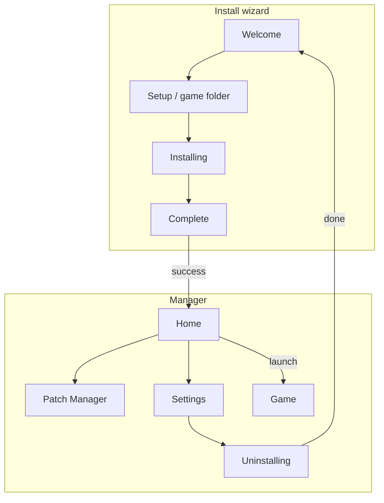

# Manager UI Architecture

Comparison of the **retired WPF manager** and the **current Electron manager**. Install, launch, and patching **on disk** are still C#; only the manager shell changed.

In-game stack is unchanged: `DustAET.exe` (`Asher.Launcher`) → `Asher.Runtime` → `Asher.Patching.*`. Migration decisions: `Electron-Migration-Implementation.md`.

---

## Current Electron structure

Electron is the official manager. WPF projects no longer exist.

```
Asher.Electron (UI)
  main/      window, HostManager, JSONL client, IPC
  preload/   window.asher (contextIsolation, no Node in renderer)
  renderer/  vanilla JS controllers, localization, theme, icons
        │ JSONL stdin/stdout
Asher.Host --jsonl
        │
IAsherApplication → Asher.Services → Asher.Core
```

| Piece | Role |
|-------|------|
| `application-shell.js` | Mode (`installWizard` / `manager`), screens, host lifecycle |
| Controllers | Setup, install, uninstall, mods, settings, launch |
| `application-client.js` | JSONL via preload; no business rules |
| `localization.js` / `theme.js` / `icons.js` | en/pt/es, Light/Dark, Material Symbols |
| `Asher.Host` | Transport only; stdout is protocol |

**Startup:** Electron window → spawn Host → `ready` → `getApplicationMode` / `getSettings` → land on setup, install, or home.

**Layout:** Collapsible sidebar + one main view. Modes:

| Mode | Screens |
|------|---------|
| Install wizard | Welcome → Setup (detect/validate) → Installing → Complete |
| Manager | Home, Patch Manager, Settings; uninstall from Settings (not in sidebar) |

---

## Retired WPF structure

Deleted: `Asher.App`, `Asher.UserInterface`, `Asher.Localization`.

| Piece | Role |
|-------|------|
| `Asher.App` | Prism `PrismApplication`; registered services in `App.xaml.cs` |
| `Asher.UserInterface` | XAML views, ViewModels, Prism `MainRegion` |
| Stack | WPF + Prism 9 + Unity + Material Design In XAML |
| Navigation | `IRegionManager.RequestNavigate`; `INavigationItemsManager` |
| State | Distributed: ViewModels, `InstallationStateService`, `IEventAggregator` |
| Theme / i18n | `IThemeService` (MaterialDesign palettes), `LocalizationManager` |

**Views (install):** Welcome, Game detection, Installing, Complete.  
**Views (manager):** Home, Patch Manager, Settings, Uninstall progress.  
**Stub:** Content Patcher (no backend then or now).

**WPF-only services (removed):** `ManagerDeploy`, `ManagerLaunch`, `Shortcut`, `InstallationState`, `NavigationItemsManager`.

**Electron install extras:** Emergency `Asher/Uninstall-Asher.cmd` in the game folder (no in-game manager deploy, no desktop shortcut).

**Install flow (Electron):** Setup → Install (runtime via Host + emergency uninstall helper) → Finish stays in Distribution → optional game launch.

---

## What stayed the same

User-facing product is still: install Asher into a game folder, toggle mods, launch the patched exe, uninstall and restore.

| Concern | Same? |
|---------|--------|
| Sidebar + single content pane | Yes |
| Install vs manager modes | Yes |
| Detect / browse / validate game folder | Yes — `IGameFolderService` |
| Install / uninstall with progress + cancel | Yes — `GameInstallationService` |
| Launcher swap (`DustAET.exe` / `.real.exe`) | Yes — `AsherPaths` |
| Mod list + enable/disable (files move, not deleted) | Yes — `PatchManagerService` |
| Launch via swapped `DustAET.exe` | Yes — `IGameLaunchService` |
| Settings: path, language, theme, backup | Yes — `AsherSettings` JSON |
| Light/dark theme, localization | Yes (different implementation) |
| Uninstall from Settings, then back to wizard | Yes |

---

## What changed

| | WPF (retired) | Electron (current) |
|--|---------------|---------------------|
| Process | One process: UI + services | Two: Electron + `Asher.Host` |
| UI kit | Prism MVVM, XAML, MaterialDesign | Vanilla JS, CSS, Material Symbols font |
| Navigation | Prism regions | `ApplicationShell.navigateTo` |
| Backend access | Constructor-injected `I*Service` | JSONL methods on `IAsherApplication` |
| Wizard lock | Later steps disabled in sidebar | Same idea; full stepper chrome still deferred |
| Settings save | Explicit Save | Auto-save on change |
| Reset | Could wipe install state | Preferences only; keeps path / installed |
| Post-install launch | Settings `AutoLaunchEnabled` (often unused) | Finish checkbox + minimize |
| Updates toggle | Settings control | Removed (never implemented) |
| Distribution | `PrepareDistribution.ps1` + `Asher.App.exe` | In-app install + `install-payload/` beside Host |
| Toasts / menu | MessageBoxes; default Electron menu later removed | Top-right toasts; no app menu |

---

## Screen map (both UIs)



| Screen | WPF | Electron |
|--------|-----|----------|
| Welcome | `WelcomeView` | `#welcome-view` |
| Game folder | `GameDetectionView` | setup view + `game-setup.js` |
| Installing | `InstallationProgressView` | `installation-controller.js` |
| Complete | `InstallationResultView` (+ shortcut) | Finish + optional launch |
| Home | `HomeView` cards | Home hub cards |
| Mods | `PatchManagerView` checkbox | Switch + incremental row update |
| Settings | `SettingsView` + Save | Settings + auto-save |
| Uninstall | `UninstallProgressView` | `uninstallation-controller.js` |

---

## Behavioral compatibility

Do not change these without an explicit requirement:

- On-disk layout under the game folder (`AsherPaths`)
- Settings file meaning (`isInstalled`, path, backup, language, theme)
- Mods enabled = DLL in `Mods/`; disabled = `DisabledMods/`
- Launch must start the launcher-named `DustAET.exe`, not `DustAET.real.exe`

Business rules stay in C#. Renderer only drives UI and JSONL.
