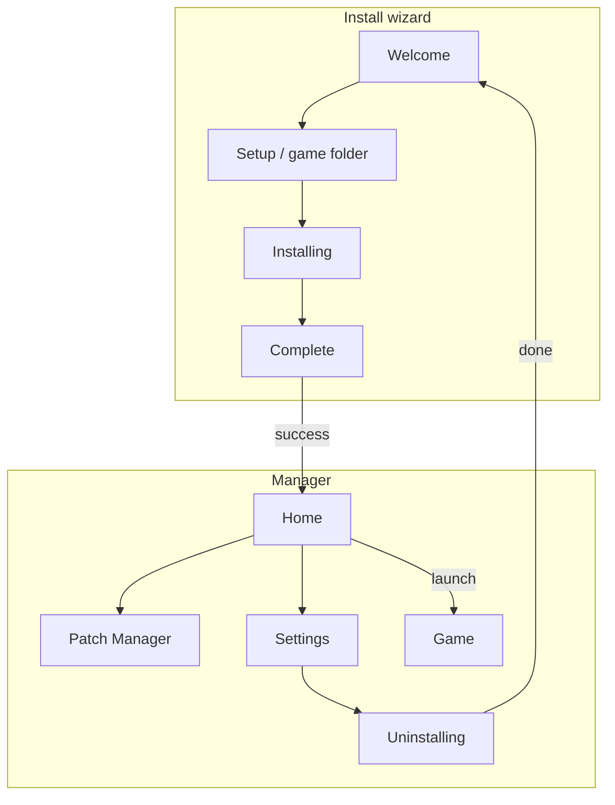

# Manager UI Architecture

The Asher manager UI is **Electron** (`Asher.Electron`). Install, launch, and patching on disk are C#
behind the headless **Asher.Host** over JSONL. The WPF manager was retired (see
`Electron-Migration-Implementation.md`).

## Electron structure

```
Asher.Electron (UI)
  main/      window, HostManager, JSONL client, IPC, updates
  preload/   window.asher (contextIsolation, no Node in renderer)
  renderer/  vanilla JS controllers, localization, theme, icons
        │ JSONL stdin/stdout
Asher.Host --jsonl
        │
IAsherApplication → Asher.Services → Asher.Core
```

| Piece | Role |
|-------|------|
| `application-shell.js` | Mode (`installWizard` / `manager`), screens, host lifecycle |
| Controllers | Setup, install, uninstall, mods, settings, launch |
| `application-state.js` | Fetches `getPlatformInfo` + `getInstallState`; derives `canUninstall`/`canRestore` |
| `application-client.js` | JSONL via preload; no business rules |
| `localization.js` / `theme.js` / `icons.js` | en/pt/es, Light/Dark, Material Symbols |
| `Asher.Host` | Transport only; stdout is protocol |

**Startup:** Electron window → spawn Host → `ready` → `getApplicationMode` / `getSettings` → land on
setup, install, or home.

**Layout:** collapsible sidebar + one main view.

| Mode | Screens |
|------|---------|
| Install wizard | Welcome → Setup (detect/validate) → Installing → Complete |
| Manager | Home, Patch Manager, Settings; uninstall from Settings (not in sidebar) |

## Screen map



## Behavioral compatibility

Do not change these without an explicit requirement:

- On-disk layout under the game folder (`AsherPaths`)
- Settings file meaning (`isInstalled`, path, backup, language, theme)
- Mods enabled = DLL in `Mods/`; disabled = `DisabledMods/`
- Windows launch must start the launcher-named `DustAET.exe`, not `DustAET.real.exe`

Business rules stay in C#; the renderer only drives UI and JSONL.

## Retired WPF manager

Deleted: `Asher.App`, `Asher.UserInterface`, `Asher.Localization` (Prism + MaterialDesign). WPF-only
services removed: `ManagerDeploy`, `ManagerLaunch`, `Shortcut`, `InstallationState`,
`NavigationItemsManager`. The user-facing product is unchanged: install into a game folder, toggle mods,
launch the patched game, uninstall and restore.
