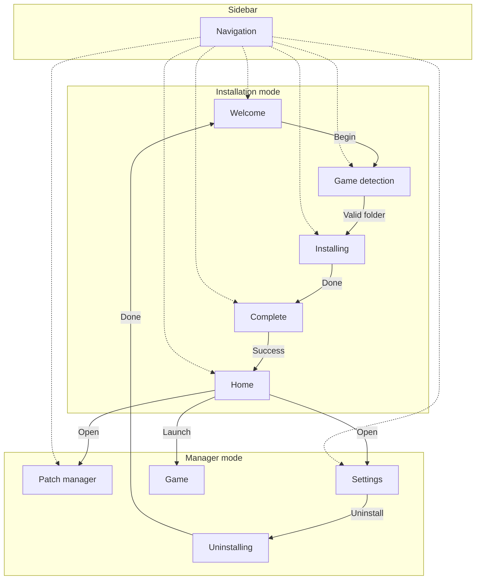

# Manager UI — Visual & Navigation Reference

> **Status:** Retired. This document describes the former desktop manager interface as a feature and layout reference.

The manager presented two distinct experiences depending on whether Asher was already installed in the user's game folder: a guided **installation flow** and a post-install **management hub**.

---

## Application shell

### Window

- Medium-sized centered window with a product title that changes between install and management contexts
- Light visual theme by default, with optional dark theme
- Scrollable content area with consistent outer spacing

### Layout

Two-column structure:

```
┌─────────────────┬──────────────────────────────────┐
│  Sidebar        │  Main content                      │
│  (collapsible)  │  (one screen at a time)          │
└─────────────────┴──────────────────────────────────┘
```

### Sidebar

| Zone | Role |
|------|------|
| **Header** | Product name and a control to expand or collapse the sidebar |
| **Navigation** | Vertical list of steps or sections, each with an icon and label |
| **Footer** | Version indicator |

**Collapse behavior:** The sidebar can shrink to show icons only. Labels and footer text fade out when collapsed. Entry uses a short slide-in animation; width changes are animated smoothly.

**Navigation item states:**
- Default — flat, left-aligned
- Selected — highlighted background
- Hover — subtle background change
- Disabled — used in the install wizard to lock future steps

### Main content

- One active screen at a time, swapped without opening new windows
- Screens share a common page structure and scroll when content overflows

---

## Visual language

### Theme

- Light and dark base themes
- Accent colors applied to headers, highlights, and key metrics
- Typography hierarchy: large titles, section subtitles (reduced opacity), body text, captions

### Recurring layout pattern

Most screens follow the same structure:

1. **Header block** — title and short description
2. **Primary content** — cards grouping related controls or information
3. **Info note** (optional) — icon + helper text at reduced emphasis
4. **Actions** — primary button (filled) and secondary button (outlined), usually right-aligned or centered

Icons accompany navigation items, status messages, and informational rows.

---

## Navigation model

### Two application modes

The shell switches entirely between **installation mode** and **manager mode** based on install state. The sidebar items, window title, and default landing screen all change with the mode.

#### Installation mode

Presented when Asher is not yet installed. A linear wizard with four steps:

| Step | Purpose | Initially accessible |
|------|---------|----------------------|
| Welcome | Introduce the process and what will happen | Yes |
| Game detection | Locate and validate the game folder | No |
| Installing | Show progress while files are deployed | No |
| Complete | Confirm outcome and offer next actions | No |

Only the current step and completed steps are selectable in the sidebar; later steps stay locked until reached.

**Flow:**

```
Welcome ──► Game detection ──► Installing ──► Complete ──► Manager mode
```

#### Manager mode

Presented when Asher is installed. Persistent navigation to core areas:

| Section | Purpose |
|---------|---------|
| Home | Hub with quick actions |
| Patch manager | Enable or disable individual mods |
| Settings | Preferences, game path, uninstall |

Uninstall progress is not listed in the sidebar; it is reached from Settings and returns to the installation wizard when finished.

**Mode transitions:**

| Trigger | Result |
|---------|--------|
| Installation succeeds | Enter manager mode; land on Home |
| Uninstall completes | Return to installation mode; restart at Welcome |

On first launch, the app detects install state and opens the appropriate mode automatically.

### Localization

- Navigation labels and most settings strings support multiple languages
- Changing language updates labels and the window title without restarting
- Some early install screens used fixed copy in one language

---

## Screens — features & elements

### Welcome (install step 1)

| Element | Purpose |
|---------|---------|
| Header | Greeting and brief overview |
| Explanation | What the installation will do |
| Info rows | Highlights: automatic backup; game files will be modified for mod support |
| Primary action | Begin the installation flow |
| Footer note | One-time process reminder |

### Game detection (install step 2)

| Element | Purpose |
|---------|---------|
| Header | Explain that a valid game folder is required |
| Auto-detect | Attempt to find the installation automatically |
| Path field | Display the chosen folder (read-only) with a browse option |
| Validation status | Success: version and source; failure: invalid folder message |
| Continue | Proceed only when a valid game folder is confirmed |

Auto-detection runs when the screen is first shown.

### Installing (install step 3)

| Element | Purpose |
|---------|---------|
| Header | Installation in progress |
| Progress indicator | Circular and linear progress with percentage when known |
| Status message | Current operation description |
| Step details | Optional supplementary detail line |
| Warning note | Do not close the application during installation |

### Install complete (install step 4)

**Success:**

| Element | Purpose |
|---------|---------|
| Success icon and message | Confirm installation finished |
| Desktop shortcut option | Optional checkbox |
| Finish action | Complete setup and enter manager mode |
| Next steps | Short list of suggested follow-up actions |

**Failure:**

| Element | Purpose |
|---------|---------|
| Error icon and message | Explain what went wrong |
| Error details | Expandable technical detail when available |
| Retry | Attempt installation again |
| Cancel | Abandon and return |

### Home (manager hub)

| Element | Purpose |
|---------|---------|
| Welcome header | Product introduction |
| Action grid | Quick-access cards in a two-by-two layout |

| Card | Action |
|------|--------|
| Patch manager | Open mod management |
| Settings | Open preferences |
| Launch game | Start the game with mods enabled |

Cards use elevation and pointer feedback to indicate interactivity.

### Patch manager

| Element | Purpose |
|---------|---------|
| Header | Title and description of mod management |
| Refresh | Reload the mod list |
| Mod list | Each entry shows name, description, and an on/off toggle |
| Empty state | Message when no mods are present |
| Summary | Count of active mods vs total mods |

Toggling a mod enables or disables it without deleting files.

### Settings

Grouped into separate cards:

**Game**

| Setting | Control |
|---------|---------|
| Game folder path | Text field with browse |
| Auto-launch | On/off toggle |
| Backup | On/off toggle |

**Application**

| Setting | Control |
|---------|---------|
| Language | Selection list |
| Theme | Light / dark selection |
| Update checks | On/off toggle |

**Uninstall** (when available)

| Element | Purpose |
|---------|---------|
| Description | What uninstall will remove or restore |
| Uninstall action | Start the removal flow |

**Actions**

| Action | Purpose |
|--------|---------|
| Reset to defaults | Restore factory preferences |
| Save | Persist current settings |

### Uninstalling (off-sidebar flow)

Same visual pattern as the install progress screen:

| Element | Purpose |
|---------|---------|
| Header | Uninstall in progress |
| Progress indicator | Circular and linear with status text |
| Step details | Optional detail line |
| Warning note | Do not close during uninstall |

Completing uninstall returns to the installation wizard at Welcome.

---

## Navigation diagram



---

## Feature summary

| Area | User-facing capability |
|------|------------------------|
| Installation | Guided setup with folder validation, progress feedback, and outcome screen |
| Mod management | View, refresh, and toggle mods individually |
| Game launch | Start the modded game from the home hub |
| Settings | Game path, language, theme, backups, auto-launch, updates |
| Uninstall | Remove Asher and restore original game files |
| Localization | Multi-language UI with live label refresh |
| Theming | Light and dark appearance |
